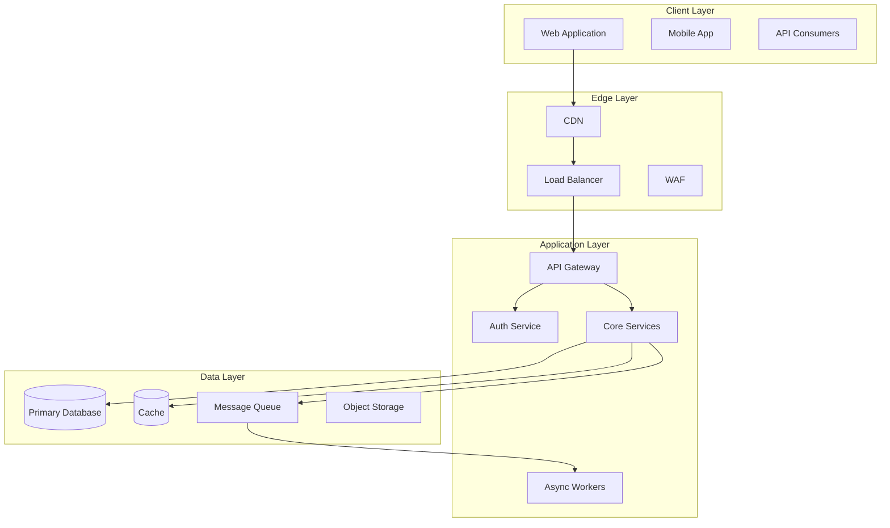
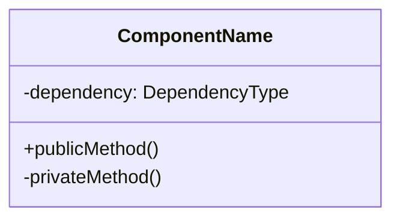
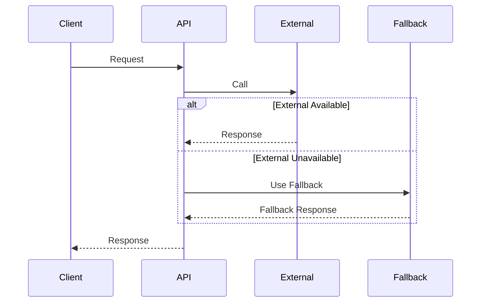

# Genesis Section 05: Architecture & Design

You are generating the Architecture & Design section of a technical specification.

**CRITICAL**: This is one of the most important sections. Use **ultrathink** extensively for architectural decisions, tradeoff analysis, and API design.

## Pre-Flight Checks

1. **Read Previous Handoffs**:
   - `genesis_output/handoffs/handoff_00_init.json` (project context)
   - `genesis_output/handoffs/handoff_03_technology_stack.json` (technology decisions)
   - `genesis_output/handoffs/handoff_04_process_flowcharts.json` (workflows)

2. **Read Section Guide**:
   Read `genesis_sources/section_guides/Genesis_Section_05_Architecture_Design.md`

3. **Review Previous Sections**:
   - Read `genesis_output/sections/03_technology_stack.md`
   - Read `genesis_output/sections/04_process_flowcharts.md`

4. **Extract Key Constraints**:
   From previous handoffs, identify:
   - Technology constraints
   - Scale requirements
   - Performance targets
   - Security requirements
   - Team expertise

## Research Phase (Parallel Subagents)

Launch the following subagents IN PARALLEL:

### Subagent 1: Architecture Patterns

```
Use genesis-researcher agent to research:
- Clean architecture patterns for [technology stack]
- Microservices vs monolith decision frameworks
- Event-driven architecture patterns
- API-first design approaches

Return: Architecture patterns, trade-offs, decision frameworks
```

### Subagent 2: API Design Standards

```
Use genesis-perplexity agent to research:
- REST API design best practices 2025
- GraphQL considerations for [use case]
- API versioning strategies
- OpenAPI/Swagger documentation standards
- Rate limiting and throttling patterns

Return: API design standards, versioning approach, documentation practices
```

### Subagent 3: Design Patterns & Libraries

```
Use genesis-documentation agent with context7 to get:
- Design patterns for [technology stack]
- State management patterns for [frontend framework]
- Error handling patterns
- Caching strategies and libraries

Return: Applicable design patterns with implementation examples
```

### Subagent 4: Reference Architectures

```
Use mcp__exa__get_code_context_exa to find:
- Reference architectures for [system type]
- Production-grade examples
- Scaling patterns from similar systems

Return: Reference implementations and lessons learned
```

Wait for all subagents to complete before proceeding.

## Synthesis Phase

### Pre-Architecture Analysis

ultrathink:
Before designing the architecture, deeply analyze:

1. What are the core quality attributes this system must exhibit?
   - Scalability: What growth patterns are expected?
   - Availability: What's the acceptable downtime?
   - Performance: What are the latency requirements?
   - Security: What's the threat model?
   - Maintainability: How will this evolve?

2. What are the key architectural drivers?
   - Must-have constraints (non-negotiable)
   - Should-have quality attributes (important)
   - Nice-to-have characteristics (optional)

3. What architectural patterns fit these drivers?
   - Evaluate 3+ options
   - Score each against drivers
   - Identify the winner and why

4. What are we optimizing for at the expense of what?
   - Every architecture is a set of tradeoffs
   - Make tradeoffs explicit and justified

### 5.1 System Architecture

ultrathink:
Design the high-level architecture considering:

ARCHITECTURAL STYLE DECISION:
- Monolith: When is this appropriate? What are the migration paths?
- Microservices: What's the bounded context decomposition?
- Serverless: What are the cold start and cost implications?
- Hybrid: Where do different styles apply?

COMMUNICATION PATTERNS:
- Synchronous: REST, gRPC - when to use each
- Asynchronous: Message queues, event buses - when to use
- Real-time: WebSockets, SSE - requirements

DEPLOYMENT TOPOLOGY:
- Where do components run?
- How do they discover each other?
- How do they handle failure?

Generate:

#### High-Level Architecture Diagram


#### Component Breakdown Table
| Component | Responsibility | Technology | Scaling Strategy |
|-----------|---------------|------------|------------------|
| [Component] | [What it does] | [Tech choice] | [How it scales] |

#### Layer Descriptions
For each layer:
- Purpose and responsibilities
- Interfaces (in and out)
- Failure handling
- Scaling approach

### 5.2 Component Architecture

ultrathink:
For each major component, design with:

1. Single Responsibility: What is this component's ONE job?
2. Interface Segregation: What interfaces does it expose?
3. Dependency Inversion: What does it depend on? How are dependencies injected?
4. Failure Isolation: How does it fail without cascading?

For each major component generate:

#### Component: [Name]


**Responsibilities:**
- Primary: [main job]
- Secondary: [additional jobs]

**Interfaces:**
- Inbound: [API/events consumed]
- Outbound: [API/events produced]

**Dependencies:**
- Required: [must have to function]
- Optional: [enhances functionality]

**Failure Modes:**
- [Failure scenario]: [How handled]

### 5.3 Design Patterns

ultrathink:
Select design patterns based on:

1. What recurring problems exist in this domain?
2. What patterns solve these problems?
3. What's the implementation cost vs benefit?
4. Are there simpler alternatives?

For each pattern, justify:
- Why this pattern (not just what)
- Where it applies
- Implementation approach
- When NOT to use it

Generate:

#### Applied Patterns
| Pattern | Purpose | Applied Where | Justification |
|---------|---------|---------------|---------------|
| [Pattern] | [Problem solved] | [Components] | [Why chosen] |

#### Pattern Implementation Details
For each pattern:
- Problem it solves
- Implementation approach
- Code structure example
- Testing considerations

#### Anti-Patterns to Avoid
| Anti-Pattern | Why Problematic | How to Avoid |
|--------------|-----------------|--------------|
| [Anti-pattern] | [Why bad] | [Prevention] |

### 5.4 API Design

ultrathink:
Design APIs with these principles:

1. INTUITIVE: Would a new developer understand this without reading docs?
2. CONSISTENT: Are patterns the same everywhere?
3. EVOLVABLE: Can we change this without breaking clients?
4. DEBUGGABLE: Are errors self-explanatory?
5. PERFORMANT: Are we efficient with network and processing?

For each API area, consider:
- Resource naming (nouns, not verbs)
- HTTP method semantics
- Pagination strategy
- Filtering and sorting
- Versioning approach
- Error format

Generate:

#### API Design Principles
- URL structure: `/api/v{version}/{resource}[/{id}][/{sub-resource}]`
- Versioning: [strategy and rationale]
- Authentication: [method and implementation]
- Rate limiting: [strategy per endpoint type]

#### Core API Endpoints
| Method | Endpoint | Description | Auth | Rate Limit |
|--------|----------|-------------|------|------------|
| [GET/POST/etc] | [path] | [purpose] | [required?] | [limit] |

#### Request/Response Formats
```json
// Standard Success Response
{
  "data": { ... },
  "meta": {
    "requestId": "uuid",
    "timestamp": "ISO8601"
  }
}

// Standard Error Response
{
  "error": {
    "code": "ERROR_CODE",
    "message": "Human readable message",
    "details": { ... },
    "requestId": "uuid"
  }
}
```

#### Error Codes
| Code | HTTP Status | Meaning | Client Action |
|------|-------------|---------|---------------|
| [CODE] | [status] | [what happened] | [what to do] |

### 5.5 Integration Architecture

ultrathink:
Design integrations considering:

1. What external systems do we depend on?
2. What's the failure mode when they're unavailable?
3. How do we handle data inconsistency?
4. What's the latency impact?
5. How do we version external API dependencies?

For each integration:
- Purpose and data flow
- Sync vs async decision
- Failure handling (retry, circuit breaker, fallback)
- Monitoring and alerting

Generate:

#### External Service Integrations
| Service | Purpose | Pattern | Fallback |
|---------|---------|---------|----------|
| [Service] | [Why needed] | [Sync/Async] | [When unavailable] |

#### Integration Flow Diagrams


### 5.6 Scalability Architecture

ultrathink:
Design for scale considering:

1. What's the expected load profile? (steady, bursty, growing)
2. What are the bottlenecks at 10x current scale?
3. What's the cost model for scaling?
4. How do we maintain consistency under load?

HORIZONTAL SCALING:
- Which components can scale horizontally?
- What state prevents horizontal scaling?
- How do we handle session affinity?

CACHING STRATEGY:
- What data is cache-worthy?
- What's the cache invalidation strategy?
- What's the cache-aside vs cache-through decision?

DATABASE SCALING:
- Read replicas: when and how many?
- Sharding: when necessary and by what key?
- Connection pooling: configuration

Generate:

#### Scaling Strategy
| Component | Scaling Type | Trigger | Max Instances | Cost Per Unit |
|-----------|-------------|---------|---------------|---------------|
| [Component] | [Horizontal/Vertical] | [CPU/Memory/Queue depth] | [limit] | [$X/hr] |

#### Caching Architecture
| Cache Layer | Technology | TTL Strategy | Invalidation |
|-------------|------------|--------------|--------------|
| [Layer] | [Redis/CDN/etc] | [TTL approach] | [How invalidated] |

#### Performance Targets
| Scenario | Current | Target | Bottleneck | Mitigation |
|----------|---------|--------|------------|------------|
| [P95 latency] | [now] | [goal] | [what limits] | [how to fix] |

## Output Requirements

Write to `genesis_output/sections/05_architecture_design.md`

Create `genesis_output/handoffs/handoff_05_architecture_design.json`:

```json
{
  "section_number": 5,
  "section_name": "Architecture & Design",
  "completed_at": "[timestamp]",
  "status": "complete",
  "ultrathink_enabled": true,

  "key_outputs": {
    "architecture_style": "[monolith/microservices/serverless/hybrid]",
    "major_components": ["component 1", "component 2"],
    "design_patterns": ["pattern 1", "pattern 2"],
    "api_style": "[REST/GraphQL/hybrid]",
    "communication_patterns": ["sync/async/event-driven"]
  },

  "architectural_decisions": [
    {
      "decision": "[what was decided]",
      "rationale": "[why - from ultrathink]",
      "tradeoffs": "[what was sacrificed]",
      "alternatives": ["considered options"],
      "reversibility": "easy/medium/hard"
    }
  ],

  "api_endpoints": [
    {"method": "GET", "path": "/api/v1/resource", "description": "...", "auth": "required"}
  ],

  "integration_points": [
    {"system": "name", "type": "sync/async", "purpose": "description", "fallback": "strategy"}
  ],

  "scaling_limits": {
    "horizontal_max": "[instances]",
    "bottlenecks": ["identified bottlenecks"],
    "cost_at_scale": "[projected cost]"
  },

  "decisions_made": [],
  "assumptions": [],
  "open_questions": [],

  "next_section_context": {
    "for_section_06": "Data requirements from architecture - entities, relationships, access patterns",
    "for_section_07": "Security considerations from API design - auth, authorization, data protection"
  }
}
```

## Quality Validation

ultrathink:
Critically review the architecture:

1. Does this architecture support ALL the requirements from previous sections?
2. Are all quality attributes (scalability, availability, etc.) addressed?
3. Is every technology choice justified, not assumed?
4. Are failure modes explicitly handled, not ignored?
5. Could a senior engineer implement this without major questions?
6. What would break at 10x scale? 100x scale?
7. What's the most likely thing to go wrong?

Refine any areas with concerns before completing.

## Completion Message

```
Section 05: Architecture & Design - COMPLETE

Ultrathink Analysis:
- Architecture Style: [chosen style with key rationale]
- Key Tradeoffs: [what was optimized vs sacrificed]
- Scaling Limit: [where this architecture breaks]

Summary:
- Architecture Style: [style]
- Major Components: [count]
- Design Patterns: [list]
- API Style: [style]
- Integration Points: [count]

Architectural Decisions Made:
- [Decision 1]: [Rationale]
- [Decision 2]: [Rationale]

Risks Identified:
- [Risk 1]: [Mitigation]
- [Risk 2]: [Mitigation]

Next steps:
1. Review the architecture design
2. Validate with senior engineers
3. Start a NEW session
4. Run: /genesis-section-06
```
