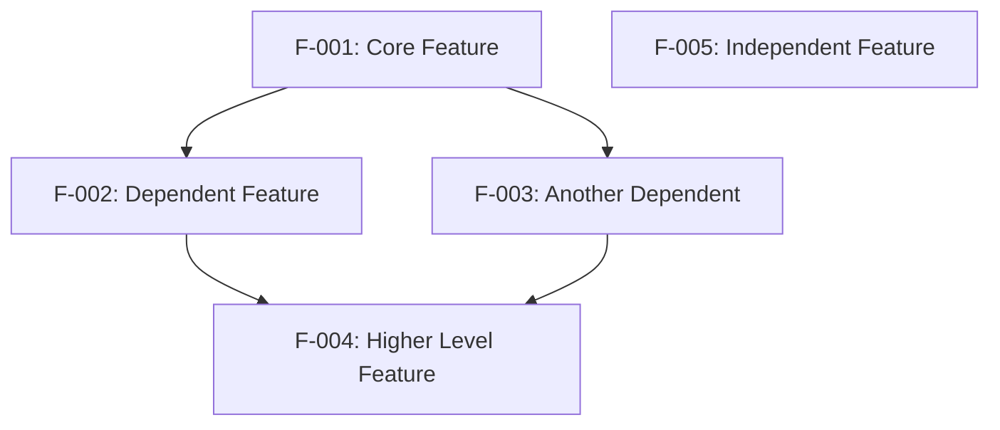

# Genesis Section 02: Product Requirements

**Purpose:** Guide for generating comprehensive Product Requirements that are actionable, traceable, and sprint-ready.

---

## Section Overview

The Product Requirements section translates business goals into specific, measurable technical requirements. This section must be detailed enough for sprint planning while maintaining clarity for all stakeholders.

### Key Components

1. **Feature Catalog**: Detailed metadata for each major feature
2. **Functional Requirements Tables**: Specific requirements with acceptance criteria
3. **Feature Relationships**: Dependencies and integration points
4. **Implementation Considerations**: Constraints, performance, scalability, security
5. **Traceability Matrix**: Links between business needs, features, and tests
6. **Assumptions and Constraints**: Documented limitations and prerequisites

---

## 2.1 Feature Catalog

### Purpose
Create a comprehensive catalog of all major features with sufficient detail for prioritization and planning.

### Feature Numbering Convention
- Use format: **F-XXX** (e.g., F-001, F-002, F-003)
- Number sequentially in order of priority or dependency
- Never reuse feature IDs

### Feature Template

For each feature, document:

```markdown
#### F-XXX: [Feature Name]

**Feature Metadata:**
- **Feature ID:** F-XXX
- **Feature Name:** [Descriptive name]
- **Feature Category:** [Logical grouping]
- **Priority Level:** [Critical/High/Medium/Low]
- **Status:** [Proposed/Approved/In Development/Complete/Deprecated]

**Description:**
- **Overview:** [What the feature does in 1-2 sentences]
- **Business Value:** [Why this feature matters to the business]
- **User Benefits:** [How users benefit from this feature]
- **Technical Context:** [Key technologies or approaches involved]

**Dependencies:**
- **Prerequisite Features:** [Features that must exist first]
- **System Dependencies:** [Required libraries, frameworks, APIs]
- **External Dependencies:** [Third-party services, external systems]
- **Integration Requirements:** [How this connects to other components]
```

### Feature Categories

Group features logically:
- **Core**: Fundamental system capabilities
- **AI/ML**: AI-powered features and intelligence
- **Integration**: External system connections
- **Collaboration**: Multi-user and sharing features
- **Administration**: Management and configuration
- **Security**: Authentication, authorization, encryption
- **Analytics**: Reporting and insights
- **Performance**: Optimization and caching
- **UI/UX**: User interface enhancements

### Priority Levels

**Critical:**
- System cannot function without this feature
- Blocks other critical features
- Core user workflow depends on it
- Example: Authentication system, data persistence

**High:**
- Major feature with significant business value
- Affects primary user workflows
- High user demand or competitive differentiation
- Example: AI-powered suggestions, real-time collaboration

**Medium:**
- Important but not blocking
- Enhances user experience
- Addresses specific use cases
- Example: Advanced filters, keyboard shortcuts

**Low:**
- Nice-to-have feature
- Minor improvements
- Edge case handling
- Example: UI polish, additional export formats

---

## 2.2 Functional Requirements Tables

### Purpose
Break down each feature into specific, testable requirements with clear acceptance criteria.

### Requirement Numbering Convention
- Use format: **F-XXX-RQ-YYY** (e.g., F-001-RQ-001, F-001-RQ-002)
- XXX = Feature ID, YYY = Requirement number within feature
- Number sequentially starting from 001

### Requirements Table Template

For each feature, create a table:

```markdown
#### F-XXX: [Feature Name]

| Requirement ID | Description | Acceptance Criteria | Priority | Complexity |
|----------------|-------------|-------------------|----------|------------|
| F-XXX-RQ-001 | [Detailed requirement] | [Measurable success criteria] | Must-Have | High |
| F-XXX-RQ-002 | [Detailed requirement] | [Measurable success criteria] | Must-Have | Medium |
| F-XXX-RQ-003 | [Detailed requirement] | [Measurable success criteria] | Should-Have | Low |
| F-XXX-RQ-004 | [Detailed requirement] | [Measurable success criteria] | Could-Have | Medium |
| F-XXX-RQ-005 | [Detailed requirement] | [Measurable success criteria] | Should-Have | High |
```

### Writing Requirements

**Good Requirements are SMART:**
- **Specific**: Clear and unambiguous
- **Measurable**: Can be tested objectively
- **Achievable**: Technically feasible within constraints
- **Relevant**: Directly supports feature goals
- **Time-bound**: Can be completed in a sprint

**Example - Poor Requirement:**
```
The system should be fast.
```

**Example - Good Requirement:**
```
| F-001-RQ-002 | Real-time preview | Preview updates within 100ms of timeline changes | Must-Have | High |
```

### Writing Acceptance Criteria

**Structure:**
```
Given [context/precondition]
When [action/trigger]
Then [expected outcome]
```

**Examples:**

```markdown
**Acceptance Criteria:**
- Timeline supports minimum 10 video tracks, 10 audio tracks, 5 overlay tracks
- All tracks can be toggled visible/hidden independently
- Track reordering works via drag-and-drop
- Zoom level persists across sessions
```

**For UI Requirements:**
```markdown
**Acceptance Criteria:**
- Button displays loading spinner during API call
- Error messages appear in red with icon
- Success confirmation shows for 3 seconds then auto-dismisses
- Keyboard shortcuts work even when modals are open
```

**For Performance Requirements:**
```markdown
**Acceptance Criteria:**
- API response time < 200ms at 95th percentile
- Page load time < 2 seconds on 3G connection
- Database query execution < 100ms for 99% of queries
- Timeline renders 60fps with 100+ elements
```

### Priority Definitions

**Must-Have:**
- Feature is unusable without this requirement
- Core user workflow depends on it
- Blocking other requirements

**Should-Have:**
- Important for feature completeness
- Enhances user experience significantly
- Not strictly blocking

**Could-Have:**
- Nice-to-have enhancement
- Addresses edge cases
- Can be deferred if time-constrained

**Won't-Have:**
- Out of scope for current release
- Document for future consideration

### Complexity Definitions

**High:**
- Requires significant new architecture
- Multiple system integration points
- Performance optimization needed
- High technical risk
- Estimated: 2+ weeks

**Medium:**
- Some new code but uses existing patterns
- 1-2 integration points
- Moderate technical complexity
- Estimated: 3-10 days

**Low:**
- Straightforward implementation
- Uses well-established patterns
- Minimal integration
- Low technical risk
- Estimated: 1-3 days

### Technical Specifications

After each requirements table, add technical details:

```markdown
**Technical Specifications:**
- **Input Parameters:** [What data/inputs the feature accepts]
- **Output/Response:** [What the feature produces or returns]
- **Performance Criteria:** [Speed, throughput, resource requirements]
- **Data Requirements:** [Storage needs, formats, volume expectations]
```

**Example:**

```markdown
**Technical Specifications:**
- **Input Parameters:** Video files (MP4, AVI, MOV), audio files (MP3, WAV, AAC), max 2GB per file
- **Output/Response:** Real-time canvas rendering at 60fps, timeline state updates < 100ms
- **Performance Criteria:** Handle 100+ timeline elements without lag, support 4K video preview
- **Data Requirements:** IndexedDB for metadata (50MB per project), OPFS for media files (unlimited)
```

---

## 2.3 Feature Relationships

### Purpose
Document how features depend on and integrate with each other to prevent blocking issues during development.

### Feature Dependencies Map

Create a Mermaid diagram showing dependencies:



**Best Practices:**
- Show only direct dependencies (not transitive)
- Use descriptive feature names, not just IDs
- Group related features visually
- Highlight critical path features

### Integration Points Table

Document how features interact:

```markdown
| Feature Pair | Integration Type | Shared Components | Data Exchange |
|--------------|------------------|-------------------|---------------|
| F-001 ↔ F-002 | Bidirectional | [Component names] | [Data types exchanged] |
| F-002 ↔ F-003 | Orchestration | [Shared services] | [API calls, events] |
| F-001 ↔ F-005 | Data Layer | [Storage, persistence] | [File refs, metadata] |
| F-003 ↔ F-004 | Service Layer | [Backend systems] | [Generated assets, status] |
```

**Integration Types:**
- **Bidirectional**: Features communicate both ways
- **Orchestration**: One feature controls another
- **Data Layer**: Share data storage/persistence
- **Service Layer**: Share backend services
- **Event-Driven**: Communicate via events/messages
- **UI Integration**: Share screen space or navigation

### Common Services

List shared infrastructure:

```markdown
#### Common Services

- **State Management:** [Store names] shared across [feature list]
- **Storage Abstraction:** Unified interface for [storage types]
- **Event Bus:** Cross-feature communication for [event types]
- **Authentication:** User identity management for [features]
- **API Client:** Shared HTTP client for [external services]
- **Logging:** Centralized logging for [categories]
```

---

## 2.4 Implementation Considerations

### Purpose
Document technical constraints, performance requirements, scalability considerations, and security implications for each major feature.

### Template for Each Feature

```markdown
#### F-XXX: [Feature Name]

**Technical Constraints:**
- [Constraint 1 with impact]
- [Constraint 2 with impact]
- [Constraint 3 with impact]

**Performance Requirements:**
- [Metric 1 with target]
- [Metric 2 with target]
- [Metric 3 with target]

**Scalability Considerations:**
- [Scaling approach 1]
- [Scaling approach 2]
- [Optimization strategy]

**Security Implications:**
- [Security requirement 1]
- [Security requirement 2]
- [Compliance consideration]
```

### Technical Constraints

**What to document:**
- Platform limitations (browser, OS, device)
- Third-party API limitations (rate limits, quotas)
- Technical debt or legacy system issues
- Resource constraints (memory, CPU, storage)
- Network constraints (bandwidth, latency)

**Example:**
```markdown
**Technical Constraints:**
- Browser performance limitations for video files > 1GB
- Canvas rendering limited to 4096x4096 pixels in Safari
- IndexedDB quota varies by browser (50MB-unlimited)
- WebGL context loss on mobile devices requires recovery logic
```

### Performance Requirements

**What to document:**
- Response time targets (p50, p95, p99)
- Throughput requirements (requests/second, events/second)
- Resource limits (memory, CPU usage)
- Rendering performance (FPS, time to interactive)

**Example:**
```markdown
**Performance Requirements:**
- Timeline scrubbing at 60fps even with 100+ elements
- Timeline operation response time < 100ms at p95
- Preview rendering at 30fps for 1080p video
- Support for 4K video preview on high-end devices
```

### Scalability Considerations

**What to document:**
- How feature scales with users
- How feature scales with data volume
- Caching strategies
- Database optimization (indexes, partitioning)
- Code splitting and lazy loading

**Example:**
```markdown
**Scalability Considerations:**
- Virtualized timeline rendering loads only visible elements
- Lazy loading of video thumbnails (load on scroll)
- Progressive quality enhancement (low-res → high-res)
- LRU cache for decoded video frames (max 100MB)
```

### Security Implications

**What to document:**
- Authentication requirements
- Authorization rules
- Data encryption needs
- Privacy considerations
- Compliance requirements (GDPR, CCPA, etc.)
- Input validation needs

**Example:**
```markdown
**Security Implications:**
- All video processing client-side only (no server upload)
- No telemetry or usage tracking (privacy-first)
- Local storage encryption for sensitive project metadata
- Secure handling of API keys in browser storage
```

---

## 2.5 Traceability Matrix

### Purpose
Link business requirements to features to requirements to test cases for complete traceability.

### Matrix Template

```markdown
| Business Requirement | Feature ID | Requirement ID | Test Case | Acceptance Criteria |
|----------------------|------------|----------------|-----------|-------------------|
| [High-level business need] | F-XXX | F-XXX-RQ-XXX | TC-XXX | [Measurable outcome] |
| [Business goal] | F-XXX | F-XXX-RQ-XXX | TC-XXX | [Expected result] |
```

### Example

```markdown
| Business Requirement | Feature ID | Requirement ID | Test Case | Acceptance Criteria |
|----------------------|------------|----------------|-----------|-------------------|
| Professional video editing | F-001 | F-001-RQ-001 | TC-001 | Multi-track timeline with 10+ tracks |
| Privacy-first approach | F-005 | F-005-RQ-001 | TC-005 | Local-only video processing |
| AI-enhanced workflows | F-002 | F-002-RQ-001 | TC-002 | Natural language editing commands |
| Advanced video generation | F-003 | F-003-RQ-001 | TC-003 | Text-to-video generation |
| Production automation | F-004 | F-004-RQ-001 | TC-004 | Multi-agent workflow orchestration |
| No watermarks | F-005 | F-005-RQ-005 | TC-006 | Clean video exports |
```

### Best Practices

1. **One row per requirement**: Each specific requirement gets its own row
2. **Link to actual test IDs**: Reference real test case identifiers
3. **Keep acceptance criteria measurable**: Must be objectively verifiable
4. **Update as tests are written**: This is a living document
5. **Use for sprint planning**: Helps teams understand scope

---

## 2.6 Assumptions and Constraints

### Purpose
Document prerequisites, limitations, and risk factors that affect implementation.

### Assumptions

**What to document:**
- Technical assumptions about platform/environment
- User assumptions (skill level, devices, connectivity)
- Business assumptions (budget, timeline, resources)
- Data assumptions (volume, format, quality)

**Template:**
```markdown
#### Assumptions

**Technical Assumptions:**
- [Assumption 1 with implications if wrong]
- [Assumption 2]
- [Assumption 3]

**User Assumptions:**
- [Assumption 1]
- [Assumption 2]

**Business Assumptions:**
- [Assumption 1]
- [Assumption 2]

**Data Assumptions:**
- [Assumption 1]
- [Assumption 2]
```

**Example:**
```markdown
#### Assumptions

**Technical Assumptions:**
- Users have modern browsers with WebGL support (Chrome 90+, Firefox 88+, Safari 14+)
- Minimum 4GB RAM available on user devices
- IndexedDB storage quota is at least 50MB
- Stable internet connection for AI features (minimum 1Mbps)

**User Assumptions:**
- Users are familiar with basic video editing concepts
- Users accept client-side processing limitations
- Users have at least 1GB free disk space

**Business Assumptions:**
- Development team size of 5-7 engineers
- 6-month timeline to MVP
- Budget for external AI API costs ($500/month initially)
```

### Constraints

**What to document:**
- Technical limitations that cannot be changed
- Regulatory/compliance requirements
- Resource constraints (time, budget, team)
- Platform constraints (browser, OS, device)

**Template:**
```markdown
#### Constraints

**Technical Constraints:**
- [Constraint 1 with workaround if available]
- [Constraint 2]

**Regulatory/Compliance Constraints:**
- [Requirement 1]
- [Requirement 2]

**Resource Constraints:**
- [Limitation 1]
- [Limitation 2]

**Platform Constraints:**
- [Limitation 1]
- [Limitation 2]
```

**Example:**
```markdown
#### Constraints

**Technical Constraints:**
- Browser-based implementation limits video file size to ~2GB (workaround: chunked processing)
- Privacy requirements restrict cloud-based optimizations (accept slower processing)
- WebGL shader limitations on mobile devices (graceful degradation to 2D canvas)

**Regulatory/Compliance Constraints:**
- GDPR compliance required for EU users (no data collection without consent)
- CCPA compliance for California users (data deletion on request)

**Resource Constraints:**
- MVP timeline of 3 months (focus on core features only)
- $5K/month infrastructure budget (use serverless, avoid dedicated servers)
- Team of 2 frontend + 2 backend engineers (limit scope accordingly)

**Platform Constraints:**
- No support for IE11 or older browsers (focus on modern web standards)
- Mobile web only (no native apps in MVP)
```

### Risk Mitigation

For each assumption and constraint, document mitigation:

```markdown
#### Risk Mitigation

**For Assumptions:**
- [Assumption]: [What we'll do if this assumption is wrong]
- [Assumption]: [Mitigation strategy]

**For Constraints:**
- [Constraint]: [How we'll work within this limitation]
- [Constraint]: [Alternative approach]
```

**Example:**
```markdown
#### Risk Mitigation

**For Assumptions:**
- **Browser Support**: Progressive enhancement for older browsers (fallback to basic features)
- **Storage Availability**: Monitor quota usage and warn users before hitting limits
- **Internet Connectivity**: Offline mode for core editing features, queue AI requests
- **User Skill Level**: In-app tutorials and contextual help

**For Constraints:**
- **File Size Limit**: Implement chunked processing for large files, warn users at upload
- **Processing Speed**: Set clear expectations, show progress indicators, enable background processing
- **Mobile Performance**: Detect device capabilities, adjust quality settings automatically
- **Budget Limits**: Use API rate limiting, implement caching, offer paid tiers for heavy users
```

---

## Best Practices

### Feature Catalog
1. **One feature = one responsibility**: Don't create mega-features
2. **Clear naming**: Feature names should be self-explanatory
3. **Document business value**: Connect every feature to business goals
4. **Update status regularly**: Keep feature status current

### Functional Requirements
1. **Be specific**: Vague requirements lead to confusion
2. **Make it testable**: Every requirement needs clear acceptance criteria
3. **Use active voice**: "System shall..." not "System should..."
4. **One requirement per row**: Don't combine multiple requirements

### Feature Relationships
1. **Show direct dependencies only**: Avoid cluttering dependency diagrams
2. **Document integration points**: Specify how features communicate
3. **Identify shared services**: Prevent duplication

### Implementation Considerations
1. **Be realistic about constraints**: Don't hide technical limitations
2. **Quantify performance**: Use specific numbers, not adjectives
3. **Think about scale**: Consider 10x and 100x growth
4. **Document security early**: Don't treat it as an afterthought

### Traceability Matrix
1. **Keep it updated**: Update as requirements change
2. **Link to real tests**: Use actual test case IDs
3. **One requirement per row**: Maintain granularity

### Assumptions and Constraints
1. **Be explicit**: Don't assume everyone knows the assumptions
2. **Document implications**: What happens if assumptions are wrong?
3. **Plan mitigations**: Have backup plans for constraints

---

## Perplexity Research Queries

### Requirements Best Practices
- "Best practices for writing functional requirements for [system type]"
- "Acceptance criteria examples for [feature type]"
- "Requirements traceability matrix template for agile projects"

### Feature-Specific Research
- "Common features for [application type]"
- "Must-have vs nice-to-have features for [platform]"
- "Feature prioritization frameworks (MoSCoW, RICE, Kano)"

### Technical Constraints
- "Browser limitations for [technology]"
- "Performance benchmarks for [feature type]"
- "Scalability patterns for [system type]"

### Security and Compliance
- "GDPR requirements for [data type]"
- "Security best practices for [feature]"
- "Compliance checklist for [industry]"

---

## Quality Checklist

Before finalizing the Product Requirements section:

- [ ] All features have unique IDs (F-001, F-002, etc.)
- [ ] Feature metadata is complete for all features
- [ ] Every feature has business value documented
- [ ] All dependencies are identified
- [ ] Requirements tables exist for all major features
- [ ] Each requirement has clear acceptance criteria
- [ ] Priority levels (Must/Should/Could) are assigned
- [ ] Complexity estimates (High/Medium/Low) are provided
- [ ] Technical specifications documented for each feature
- [ ] Feature dependency diagram is included
- [ ] Integration points are documented
- [ ] Common services are identified
- [ ] Implementation considerations address all four areas (constraints, performance, scalability, security)
- [ ] Traceability matrix links business requirements to features
- [ ] Assumptions are documented with implications
- [ ] Constraints are documented with mitigations
- [ ] Risk mitigation strategies are provided

---

## Version History

**v1.0** (2025-11-09): Initial section guide

