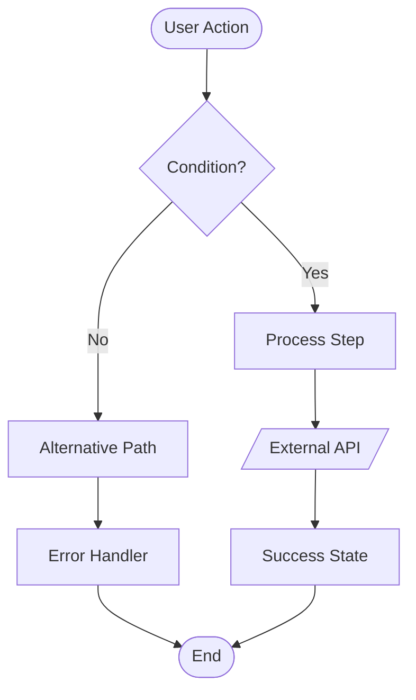

# Genesis Section 04: Process Flowcharts

**Purpose:** Guide for documenting system workflows, business logic, error handling, and state management using Mermaid diagrams.

---

## Section Overview

Process Flowcharts visualize how the system behaves dynamically. Every major user workflow, validation rule, error scenario, and state transition should be documented with clear diagrams.

### Key Components

1. **System Workflows**: Core business processes and integration workflows
2. **Validation Rules & Business Logic**: Data validation and business rules
3. **Error Handling & Recovery Procedures**: What happens when things fail
4. **State Management Architecture**: How state flows through the system
5. **Data Persistence & Transaction Boundaries**: When and how data is saved
6. **Performance Optimization Patterns**: Caching, lazy loading, virtualization

---

## 4.1 System Workflows

### Purpose
Document all major user workflows from start to completion, including happy path and alternative flows.

### Workflow Template

For each major workflow:

```markdown
#### [Workflow Name]

**Description:** [What this workflow accomplishes]

**Triggers:** [What starts this workflow]

**Actors:** [Who/what is involved - users, systems, services]

**Preconditions:** [What must be true before this workflow starts]

**Postconditions:** [System state after successful completion]

**Steps:**
[Mermaid flowchart]

**Error Paths:** [What can go wrong and how it's handled]

**Performance Considerations:** [Expected latency, optimization strategies]
```

### Mermaid Flowchart Syntax



**Best Practices:**
- Use meaningful node labels (not "Step 1", "Step 2")
- Show decision points clearly
- Indicate external calls with special shapes
- Mark async operations
- Show error paths in red
- Keep diagrams focused (max 15-20 nodes)

### Example: Video Upload and Processing

```markdown
#### Video Upload and Processing Workflow

**Description:** User uploads a video file, system validates it, processes it for the timeline, and stores it locally.

**Triggers:** 
- User drags file into upload zone
- User clicks "Add Media" button and selects file
- File is pasted via clipboard

**Actors:**
- User (initiates upload)
- Browser File API (provides file access)
- Video Processing Engine (validates and processes)
- OPFS Storage (persists video file)
- IndexedDB (stores metadata)

**Preconditions:**
- User has sufficient storage quota
- Browser supports required video codecs
- User has granted necessary permissions

**Postconditions:**
- Video file stored in OPFS
- Metadata stored in IndexedDB
- Thumbnail generated and cached
- Video appears in media library
- Video is ready to be added to timeline

**Steps:**

\`\`\`mermaid
flowchart TD
    Start([User Selects Video]) --> Validate{Valid Format?}
    Validate -->|No| FormatError[Show Format Error]
    Validate -->|Yes| CheckSize{Size < 2GB?}
    CheckSize -->|No| SizeError[Show Size Error]
    CheckSize -->|Yes| CheckQuota{Storage Available?}
    CheckQuota -->|No| QuotaError[Show Quota Error]
    CheckQuota -->|Yes| StartUpload[Initialize Upload]
    StartUpload --> ChunkUpload[Upload Chunks to OPFS]
    ChunkUpload --> Progress[Update Progress Bar]
    Progress --> AllChunks{All Chunks Uploaded?}
    AllChunks -->|No| ChunkUpload
    AllChunks -->|Yes| Validate2{File Integrity Check}
    Validate2 -->|Failed| CorruptError[Show Corruption Error]
    Validate2 -->|Passed| ExtractMeta[Extract Video Metadata]
    ExtractMeta --> GenThumb[Generate Thumbnail]
    GenThumb --> SaveMeta[Save Metadata to IndexedDB]
    SaveMeta --> UpdateUI[Add to Media Library]
    UpdateUI --> Success([Upload Complete])
    FormatError --> End([End])
    SizeError --> End
    QuotaError --> End
    CorruptError --> Cleanup[Delete Partial File]
    Cleanup --> End
\`\`\`

**Error Paths:**
- **Invalid Format:** Show supported formats, allow retry
- **File Too Large:** Suggest compression, provide size limit
- **Insufficient Storage:** Show quota usage, offer cleanup tool
- **Corruption:** Delete partial upload, allow retry

**Performance Considerations:**
- Chunked upload (5MB chunks) to prevent browser hang
- Thumbnail generation uses Web Worker (non-blocking)
- Progress updates throttled to 100ms intervals
- Metadata extraction runs in background thread
```

### Common Workflow Types

**User Onboarding Workflows:**
- Account creation
- First-time setup
- Tutorial/guided tour

**Core Feature Workflows:**
- Primary user task flows
- Multi-step processes
- Wizard-style interactions

**Integration Workflows:**
- External API calls
- Third-party service interactions
- Data sync processes

**Background Workflows:**
- Scheduled jobs
- Queue processing
- Batch operations

---

## 4.2 Validation Rules & Business Logic

### Purpose
Document all validation rules and business logic that govern system behavior.

### Validation Template

```markdown
#### [Entity/Feature] Validation Rules

**Field-Level Validation:**
| Field | Rules | Error Message | Validation Timing |
|-------|-------|---------------|-------------------|
| [Field Name] | [Rule 1, Rule 2] | [Message] | [On blur/On submit/Real-time] |

**Entity-Level Validation:**
- [Cross-field validation rule]
- [Business constraint]

**Mermaid Diagram:**
[Show validation flow]
```

### Example

```markdown
#### Video File Validation Rules

**Field-Level Validation:**
| Field | Rules | Error Message | Validation Timing |
|-------|-------|---------------|-------------------|
| File Type | Must be video/* MIME type | "Only video files are supported" | On file select |
| File Size | Max 2GB | "File must be smaller than 2GB" | On file select |
| Codec | Must be H.264, H.265, VP9, or AV1 | "Unsupported video codec" | After metadata extraction |
| Resolution | Max 4096x2160 (4K) | "Resolution exceeds maximum 4K" | After metadata extraction |
| Frame Rate | 1-120 FPS | "Frame rate must be between 1-120 FPS" | After metadata extraction |

**Entity-Level Validation:**
- Total project size (all videos) cannot exceed available storage quota minus 100MB buffer
- At least one video track must be present in timeline before export
- Export resolution cannot exceed highest resolution of source videos

**Validation Flow:**

\`\`\`mermaid
flowchart TD
    File[File Selected] --> MIME{MIME Type Valid?}
    MIME -->|No| ErrorMIME[Reject: Format Error]
    MIME -->|Yes| Size{Size <= 2GB?}
    Size -->|No| ErrorSize[Reject: Size Error]
    Size -->|Yes| Load[Load Metadata]
    Load --> Codec{Codec Supported?}
    Codec -->|No| ErrorCodec[Reject: Codec Error]
    Codec -->|Yes| Resolution{Resolution <= 4K?}
    Resolution -->|No| ErrorRes[Reject: Resolution Error]
    Resolution -->|Yes| FPS{FPS in Range?}
    FPS -->|No| ErrorFPS[Reject: FPS Error]
    FPS -->|Yes| Quota{Quota Available?}
    Quota -->|No| ErrorQuota[Reject: Storage Full]
    Quota -->|Yes| Accept[Accept File]
\`\`\`
```

---

## 4.3 Error Handling & Recovery Procedures

### Purpose
Document how the system handles errors, what recovery mechanisms exist, and how failures are communicated.

### Error Handling Template

```markdown
#### Error Handling Strategy

**Error Categories:**
- **[Category 1]:** [Types of errors, examples]
- **[Category 2]:** [Types of errors, examples]

**Error Flow Diagram:**
[Mermaid flowchart showing error detection, classification, handling]

**Recovery Strategies:**
| Error Type | Detection Method | Recovery Action | User Communication |
|------------|------------------|-----------------|---------------------|
| [Error] | [How we detect it] | [What we do] | [What user sees] |

**Fallback Mechanisms:**
- [Primary approach] → [Fallback 1] → [Fallback 2] → [Final fallback]
```

### Example

```markdown
#### Error Handling Strategy

**Error Categories:**
- **Network Errors:** API timeouts, connection failures, DNS errors
- **Storage Errors:** Quota exceeded, write failures, corruption
- **Processing Errors:** Invalid input, unsupported format, resource exhaustion
- **Authentication Errors:** Token expired, invalid credentials, permission denied
- **External Service Errors:** AI API failures, ComfyUI unavailable, rate limits

**Error Flow Diagram:**

\`\`\`mermaid
flowchart TD
    Operation[Operation Executes] --> Success{Success?}
    Success -->|Yes| Complete([Operation Complete])
    Success -->|No| Detect[Error Detected]
    Detect --> Classify{Error Category}
    Classify -->|Network| NetworkHandler[Network Error Handler]
    Classify -->|Storage| StorageHandler[Storage Error Handler]
    Classify -->|Processing| ProcessHandler[Processing Error Handler]
    Classify -->|Auth| AuthHandler[Auth Error Handler]
    Classify -->|External| ExternalHandler[External Service Handler]
    
    NetworkHandler --> Retry{Retry Count < 3?}
    Retry -->|Yes| Backoff[Exponential Backoff]
    Backoff --> Operation
    Retry -->|No| NetworkFallback[Use Cached Data]
    NetworkFallback --> UserNotify1[Notify User: Offline Mode]
    
    StorageHandler --> CheckQuota{Quota Issue?}
    CheckQuota -->|Yes| CleanupOffer[Offer Cleanup Tool]
    CheckQuota -->|No| Fallback[Try Alternative Storage]
    
    ProcessHandler --> Fallback2[Reduce Quality]
    Fallback2 --> RetryProcess{Retry with Lower Quality}
    RetryProcess -->|Success| Partial([Partial Success])
    RetryProcess -->|Failed| ProcessFail[Log and Report]
    
    AuthHandler --> RefreshToken{Can Refresh Token?}
    RefreshToken -->|Yes| RefreshFlow[Refresh Auth Token]
    RefreshFlow --> Operation
    RefreshToken -->|No| ReAuth[Redirect to Login]
    
    ExternalHandler --> CheckStatus{Service Status}
    CheckStatus -->|Temporary| QueueJob[Queue for Retry]
    CheckStatus -->|Permanent| DisableFeature[Disable Feature Gracefully]
    
    ProcessFail --> ErrorLog[Log to Sentry]
    ErrorLog --> UserError([Show User Error])
\`\`\`

**Recovery Strategies:**
| Error Type | Detection Method | Recovery Action | User Communication |
|------------|------------------|-----------------|---------------------|
| Network Timeout | Fetch timeout (30s) | Retry with exponential backoff (3 attempts) | "Connection slow, retrying..." |
| Storage Quota | QuotaExceededError | Offer cleanup tool, suggest file deletion | "Storage full. Free up space?" |
| Invalid Video Format | Codec detection failure | Suggest conversion tool | "Format not supported. Try converting to MP4" |
| AI API Rate Limit | 429 HTTP status | Queue request, retry after rate limit reset | "AI service busy. Your request is queued (position: 3)" |
| ComfyUI Unavailable | Connection refused | Disable video generation UI, queue for later | "Video generation offline. Will retry automatically" |

**Fallback Mechanisms:**
- **AI Chat:** Gemini API → OpenAI API → Disable AI features → Show offline message
- **Storage:** IndexedDB → LocalStorage (limited) → In-memory only → Warn user
- **Video Processing:** GPU acceleration → CPU (slower) → Reduced quality → Show limitations
- **Thumbnail Generation:** High quality → Medium quality → Low quality → Placeholder image
```

---

## 4.4 State Management Architecture

### Purpose
Document how state flows through the application, where it's stored, and how components interact with it.

### State Architecture Template

```markdown
#### State Management Architecture

**State Categories:**
- **[Category 1]:** [What state, where stored]
- **[Category 2]:** [What state, where stored]

**State Flow Diagram:**
[Mermaid showing data flow between stores, components, persistence]

**Store Structure:**
[Describe store organization]

**Synchronization Strategy:**
[How state syncs between client and server]
```

### Example

```markdown
#### State Management Architecture

**State Categories:**
- **Editor State:** Current project, timeline, tracks, elements, playback position, zoom level
- **Media Library State:** Uploaded videos, thumbnails, metadata, organization
- **AI Chat State:** Conversation history, active chat, pending requests, suggestions
- **UI State:** Selected elements, active tool, modal state, sidebar visibility
- **User State:** Preferences, settings, authentication, project list
- **Job Queue State:** Active jobs, job status, queue position, results

**State Flow Diagram:**

\`\`\`mermaid
flowchart LR
    User[User Action] --> Component[React Component]
    Component --> Store[Zustand Store]
    Store --> Middleware1[IndexedDB Middleware]
    Store --> Middleware2[PostgreSQL Sync Middleware]
    Middleware1 --> IDB[(IndexedDB)]
    Middleware2 --> API[API Route]
    API --> DB[(PostgreSQL)]
    
    IDB -.Load on Init.-> Store
    DB -.Load on Auth.-> Store
    
    Store --> Selector[Store Selector]
    Selector --> Component2[Other Components]
    
    External[External Event] --> API
    API --> Pusher[Realtime Updates]
    Pusher --> Store
\`\`\`

**Store Structure:**

\`\`\`typescript
// Editor Store (Zustand)
interface EditorStore {
  project: Project | null;
  timeline: Timeline;
  tracks: Track[];
  elements: TimelineElement[];
  playbackPosition: number;
  zoom: number;
  selectedElements: string[];
  
  // Actions
  addTrack: (track: Track) => void;
  removeTrack: (trackId: string) => void;
  addElement: (element: TimelineElement) => void;
  updateElement: (elementId: string, updates: Partial<TimelineElement>) => void;
  setPlaybackPosition: (position: number) => void;
}

// Media Library Store (Zustand)
interface MediaLibraryStore {
  videos: VideoAsset[];
  thumbnails: Map<string, string>;
  selectedAssets: string[];
  
  // Actions
  addVideo: (video: VideoAsset) => Promise<void>;
  deleteVideo: (videoId: string) => Promise<void>;
  generateThumbnail: (videoId: string) => Promise<string>;
}

// AI Chat Store (Zustand)
interface ChatStore {
  conversations: Conversation[];
  activeConversationId: string | null;
  messages: Message[];
  pendingRequest: boolean;
  
  // Actions
  sendMessage: (content: string) => Promise<void>;
  createConversation: () => string;
  deleteConversation: (conversationId: string) => void;
}
\`\`\`

**Synchronization Strategy:**
- **Editor State:** IndexedDB persistence (local-only, no server sync)
- **Media Library State:** IndexedDB for metadata + OPFS for files (local-only)
- **AI Chat State:** IndexedDB for cache + PostgreSQL for persistence + real-time sync
- **UI State:** SessionStorage (ephemeral, not persisted)
- **User State:** PostgreSQL only (auth-required, fetched on login)
- **Job Queue State:** Redis (backend) → API polling → Zustand store
```

---

## 4.5 Data Persistence & Transaction Boundaries

### Purpose
Document when and how data is saved, what constitutes a transaction, and how consistency is maintained.

### Persistence Template

```markdown
#### Data Persistence Strategy

**Persistence Points:**
| Data Type | Storage | When Saved | Consistency Model |
|-----------|---------|------------|-------------------|
| [Data] | [Where] | [Trigger] | [Eventual/Strong/Session] |

**Transaction Boundaries:**
[Describe what operations are atomic]

**Mermaid Diagram:**
[Show persistence flow]

**Conflict Resolution:**
[How conflicts are handled]
```

### Example

```markdown
#### Data Persistence Strategy

**Persistence Points:**
| Data Type | Storage | When Saved | Consistency Model |
|-----------|---------|------------|-------------------|
| Project metadata | IndexedDB | Auto-save every 30s, on manual save, on close | Session consistency |
| Timeline state | IndexedDB | Auto-save every 30s, after each action (debounced) | Session consistency |
| Video files | OPFS | Immediately on upload | Strong consistency |
| Chat messages | IndexedDB + PostgreSQL | Immediately on send | Eventual consistency |
| User preferences | PostgreSQL | On change (debounced 1s) | Eventual consistency |
| Job results | Redis → PostgreSQL | On job completion | Strong consistency |

**Transaction Boundaries:**

**Atomic Operations:**
- Add element to timeline + update track references (single IndexedDB transaction)
- Delete video + delete thumbnails + update project references (single OPFS + IndexedDB transaction)
- Chat message save + conversation update (single PostgreSQL transaction)

**Multi-Step Operations:**
- Video upload: File write → Metadata extraction → Thumbnail generation → IndexedDB save
  - Rollback strategy: Delete file if any step fails after file write
  
- Project save: Validate → Serialize → Compress → Write to IndexedDB
  - Rollback strategy: Keep previous version until new version written successfully

**Persistence Flow:**

\`\`\`mermaid
sequenceDiagram
    participant User
    participant Component
    participant Store
    participant Middleware
    participant IndexedDB
    participant API
    participant PostgreSQL
    
    User->>Component: Edit Timeline
    Component->>Store: Update State
    Store->>Store: Debounce 500ms
    Store->>Middleware: Persist Action
    
    Middleware->>IndexedDB: Write Transaction (Async)
    Middleware->>API: Sync to Server (if authenticated)
    
    IndexedDB-->>Middleware: Write Complete
    Middleware-->>Store: Update Sync Status
    
    API->>PostgreSQL: Write Transaction
    PostgreSQL-->>API: Acknowledge
    API-->>Middleware: Sync Complete
    Middleware-->>Store: Clear Sync Pending
    Store-->>Component: Re-render (if needed)
\`\`\`

**Conflict Resolution:**
- **Client-side conflicts:** Last write wins (single user, no concurrent edits)
- **Chat history sync:** Server is source of truth, merge with local optimistic updates
- **Project sync:** Detect conflicts via timestamp, offer "Keep Local" or "Use Server" dialog
- **Job results:** Server is source of truth, overwrite client-side cached results
```

---

## 4.6 Performance Optimization Patterns

### Purpose
Document performance optimization strategies like caching, lazy loading, virtualization, and debouncing.

### Optimization Template

```markdown
#### Performance Optimization Patterns

**Pattern:** [Pattern Name]
**Use Case:** [Where this is applied]
**Implementation:** [How it works]
**Impact:** [Performance improvement]
**Mermaid Diagram:** [Visualization]
```

### Examples

```markdown
#### Performance Optimization Patterns

##### Pattern: Timeline Virtualization

**Use Case:** Timeline with 100+ elements

**Implementation:**
- Only render elements visible in viewport
- Pre-render 50px buffer above/below viewport
- Lazy load thumbnails on scroll
- Reuse DOM nodes for off-screen elements

**Impact:** 
- Reduces DOM nodes from 1000+ to ~20
- Maintains 60fps scrolling with 500+ elements
- Reduces initial render time from 3s to 200ms

**Diagram:**

\`\`\`mermaid
flowchart LR
    Timeline[Timeline: 500 elements] --> Viewport{In Viewport?}
    Viewport -->|Yes| Render[Render 20 elements]
    Viewport -->|No| Skip[Skip Rendering]
    Render --> Buffer{Within 50px Buffer?}
    Buffer -->|Yes| PreRender[Pre-render Element]
    Buffer -->|No| Unload[Unload Element]
    PreRender --> Pool[DOM Node Pool]
    Unload --> Pool
    Pool --> Reuse[Reuse Nodes]
\`\`\`

##### Pattern: Thumbnail Generation Queue

**Use Case:** Generating thumbnails for 50+ videos without blocking UI

**Implementation:**
- Queue thumbnail generation requests
- Process 2 thumbnails concurrently (Web Workers)
- Prioritize visible videos
- Cache generated thumbnails in IndexedDB

**Impact:**
- Non-blocking UI during batch uploads
- Visible thumbnails load first (perceived performance)
- Reduces redundant work via caching

**Diagram:**

\`\`\`mermaid
flowchart TD
    Videos[50 Videos Uploaded] --> Queue[Thumbnail Queue]
    Queue --> Priority{Visible?}
    Priority -->|Yes| HighPri[High Priority Queue]
    Priority -->|No| LowPri[Low Priority Queue]
    
    HighPri --> Worker1[Web Worker 1]
    LowPri --> Worker2[Web Worker 2]
    
    Worker1 --> Check1{In Cache?}
    Worker2 --> Check2{In Cache?}
    
    Check1 -->|Yes| Load1[Load from IndexedDB]
    Check1 -->|No| Generate1[Generate Thumbnail]
    
    Check2 -->|Yes| Load2[Load from IndexedDB]
    Check2 -->|No| Generate2[Generate Thumbnail]
    
    Generate1 --> Save1[Save to IndexedDB]
    Generate2 --> Save2[Save to IndexedDB]
    
    Load1 --> Display1[Display Thumbnail]
    Save1 --> Display1
    Load2 --> Display2[Display Thumbnail]
    Save2 --> Display2
\`\`\`

##### Pattern: Debounced Auto-Save

**Use Case:** Prevent excessive writes during rapid user edits

**Implementation:**
- Debounce save operations by 500ms
- Track "dirty" state
- Force save on window unload
- Show save indicator ("Saving..." → "Saved")

**Impact:**
- Reduces IndexedDB writes from 100/min to 2-3/min during active editing
- Prevents UI jank from excessive I/O
- Maintains data safety with unload handler

**Diagram:**

\`\`\`mermaid
sequenceDiagram
    participant User
    participant Component
    participant Debouncer
    participant Storage
    
    User->>Component: Edit Action
    Component->>Debouncer: Request Save
    Debouncer->>Debouncer: Start 500ms Timer
    
    User->>Component: Another Edit
    Component->>Debouncer: Request Save
    Debouncer->>Debouncer: Reset Timer
    
    User->>Component: Yet Another Edit
    Component->>Debouncer: Request Save
    Debouncer->>Debouncer: Reset Timer
    
    Note over Debouncer: 500ms pass with no edits
    
    Debouncer->>Storage: Execute Save
    Storage-->>Component: Save Complete
    Component-->>User: Show "Saved" Indicator
\`\`\`
```

---

## Best Practices

1. **Use Mermaid diagrams**: Visual > text for flows
2. **Show error paths**: Not just happy path
3. **Include timing**: Debounces, timeouts, retries
4. **Document alternatives**: What happens when primary path fails
5. **Keep diagrams focused**: Max 20 nodes, split complex flows
6. **Use consistent notation**: Same symbols for same concepts
7. **Add performance metrics**: Expected latency, throughput

---

## Perplexity Research Queries

- "Mermaid flowchart best practices for technical documentation"
- "Error handling patterns for [specific technology]"
- "State management architecture for [framework]"
- "Performance optimization patterns for [use case]"
- "Data persistence strategies for [application type]"

---

## Quality Checklist

- [ ] All major workflows documented
- [ ] Error paths shown in flowcharts
- [ ] Validation rules clearly defined
- [ ] Error handling strategies documented
- [ ] Recovery mechanisms specified
- [ ] State management architecture explained
- [ ] Store structure defined
- [ ] Persistence points documented
- [ ] Transaction boundaries clear
- [ ] Conflict resolution strategies defined
- [ ] Performance optimization patterns documented
- [ ] Mermaid diagrams use consistent notation
- [ ] Performance impact quantified

---

## Version History

**v1.0** (2025-11-09): Initial section guide

