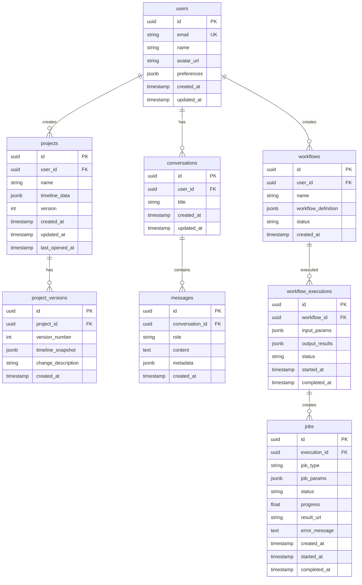

# Genesis Section 06: Data Models & Schema

**Purpose:** Guide for documenting database schemas, client-side data models, and validation rules.

---

## Section Overview

The Data Models section defines all data structures used in the system, from database tables to client-side TypeScript interfaces, including validation rules and relationships.

### Key Components

1. **Database Schema**: Tables, columns, indexes, relationships
2. **Client-Side Data Models**: TypeScript interfaces, IndexedDB schema
3. **Data Validation Rules**: Field validation, business rules, constraints

---

## 6.1 Database Schema (Server-Side)

### Purpose
Document the PostgreSQL schema with tables, relationships, indexes, and constraints.

### Entity-Relationship Diagram



### Table Documentation Template

```markdown
#### Table: [table_name]

**Purpose:** [What this table stores]

**Relationships:**
- [Relationship description]

**Columns:**
| Column | Type | Constraints | Description |
|--------|------|-------------|-------------|
| [column] | [type] | [constraints] | [description] |

**Indexes:**
| Index Name | Columns | Type | Purpose |
|------------|---------|------|---------|
| [index] | [columns] | [btree/gin/gist] | [why this index] |

**Sample Query:**
\`\`\`sql
[Example query using this table]
\`\`\`
```

### Example Table Documentation

```markdown
#### Table: users

**Purpose:** Store user account information and preferences.

**Relationships:**
- One-to-many with projects (one user creates many projects)
- One-to-many with conversations (one user has many chat conversations)
- One-to-many with workflows (one user creates many workflows)

**Columns:**
| Column | Type | Constraints | Description |
|--------|------|-------------|-------------|
| id | UUID | PRIMARY KEY, DEFAULT uuid_generate_v4() | Unique user identifier |
| email | VARCHAR(255) | NOT NULL, UNIQUE | User email (for login) |
| name | VARCHAR(255) | NOT NULL | Display name |
| avatar_url | TEXT | NULL | Profile picture URL |
| preferences | JSONB | DEFAULT '{}' | User preferences (theme, shortcuts, etc.) |
| created_at | TIMESTAMP | DEFAULT NOW() | Account creation time |
| updated_at | TIMESTAMP | DEFAULT NOW() | Last update time |

**Indexes:**
| Index Name | Columns | Type | Purpose |
|------------|---------|------|---------|
| users_email_idx | email | btree | Fast login lookup |
| users_created_at_idx | created_at | btree | User growth analytics |
| users_preferences_idx | preferences | gin | Search preferences (e.g., theme: "dark") |

**Triggers:**
\`\`\`sql
CREATE TRIGGER users_updated_at
BEFORE UPDATE ON users
FOR EACH ROW
EXECUTE FUNCTION update_updated_at_column();
\`\`\`

**Sample Query:**
\`\`\`sql
-- Find users with dark mode enabled
SELECT id, name, email
FROM users
WHERE preferences @> '{"theme": "dark"}';

-- Get user with recent projects
SELECT u.*, COUNT(p.id) as project_count
FROM users u
LEFT JOIN projects p ON p.user_id = u.id
  AND p.last_opened_at > NOW() - INTERVAL '30 days'
WHERE u.id = $1
GROUP BY u.id;
\`\`\`

---

#### Table: projects

**Purpose:** Store video editing project metadata (timeline data stored in JSONB for flexibility).

**Relationships:**
- Many-to-one with users (many projects belong to one user)
- One-to-many with project_versions (one project has many versions)

**Columns:**
| Column | Type | Constraints | Description |
|--------|------|-------------|-------------|
| id | UUID | PRIMARY KEY, DEFAULT uuid_generate_v4() | Unique project identifier |
| user_id | UUID | NOT NULL, FOREIGN KEY (users.id) ON DELETE CASCADE | Project owner |
| name | VARCHAR(500) | NOT NULL | Project name |
| timeline_data | JSONB | NOT NULL, DEFAULT '{}' | Timeline state (tracks, elements, settings) |
| version | INTEGER | NOT NULL, DEFAULT 1 | Current version number |
| created_at | TIMESTAMP | DEFAULT NOW() | Project creation time |
| updated_at | TIMESTAMP | DEFAULT NOW() | Last update time |
| last_opened_at | TIMESTAMP | DEFAULT NOW() | Last time user opened project |

**Indexes:**
| Index Name | Columns | Type | Purpose |
|------------|---------|------|---------|
| projects_user_id_idx | user_id | btree | Fast user project lookup |
| projects_last_opened_idx | last_opened_at DESC | btree | Recent projects query |
| projects_name_search_idx | name | gin (pg_trgm) | Full-text search on project names |
| projects_timeline_data_idx | timeline_data | gin | Search timeline data (e.g., specific effects) |

**Constraints:**
\`\`\`sql
ALTER TABLE projects
ADD CONSTRAINT projects_name_not_empty CHECK (length(trim(name)) > 0);

ALTER TABLE projects
ADD CONSTRAINT projects_version_positive CHECK (version > 0);
\`\`\`

**Sample Query:**
\`\`\`sql
-- Get user's most recent projects
SELECT id, name, last_opened_at, updated_at
FROM projects
WHERE user_id = $1
ORDER BY last_opened_at DESC
LIMIT 10;

-- Search projects by name
SELECT id, name, updated_at
FROM projects
WHERE user_id = $1
  AND name ILIKE '%' || $2 || '%'
ORDER BY updated_at DESC;

-- Find projects using a specific video asset
SELECT p.id, p.name, p.updated_at
FROM projects p
WHERE p.user_id = $1
  AND p.timeline_data @> jsonb_build_object(
    'elements', jsonb_build_array(
      jsonb_build_object('assetId', $2)
    )
  );
\`\`\`

---

#### Table: jobs

**Purpose:** Track video generation job status and results.

**Relationships:**
- Many-to-one with workflow_executions (many jobs per execution)

**Columns:**
| Column | Type | Constraints | Description |
|--------|------|-------------|-------------|
| id | UUID | PRIMARY KEY, DEFAULT uuid_generate_v4() | Unique job identifier |
| execution_id | UUID | NOT NULL, FOREIGN KEY (workflow_executions.id) ON DELETE CASCADE | Parent execution |
| job_type | VARCHAR(100) | NOT NULL | Type of job (e.g., "video_generation") |
| job_params | JSONB | NOT NULL | Job parameters (prompt, settings) |
| status | VARCHAR(50) | NOT NULL, DEFAULT 'queued' | Job status (queued/processing/complete/failed) |
| progress | FLOAT | DEFAULT 0.0 | Job progress (0.0-1.0) |
| result_url | TEXT | NULL | URL to generated video (when complete) |
| error_message | TEXT | NULL | Error details (when failed) |
| created_at | TIMESTAMP | DEFAULT NOW() | Job creation time |
| started_at | TIMESTAMP | NULL | Job start time |
| completed_at | TIMESTAMP | NULL | Job completion time |

**Indexes:**
| Index Name | Columns | Type | Purpose |
|------------|---------|------|---------|
| jobs_status_idx | status | btree | Queue queries (find queued jobs) |
| jobs_created_at_idx | created_at DESC | btree | Recent jobs query |
| jobs_execution_id_idx | execution_id | btree | Jobs per execution lookup |

**Constraints:**
\`\`\`sql
ALTER TABLE jobs
ADD CONSTRAINT jobs_status_valid CHECK (
  status IN ('queued', 'processing', 'complete', 'failed')
);

ALTER TABLE jobs
ADD CONSTRAINT jobs_progress_range CHECK (
  progress >= 0.0 AND progress <= 1.0
);
\`\`\`

**Sample Query:**
\`\`\`sql
-- Get next queued job
SELECT id, job_params
FROM jobs
WHERE status = 'queued'
ORDER BY created_at ASC
LIMIT 1
FOR UPDATE SKIP LOCKED;

-- Get job status
SELECT id, status, progress, result_url, error_message
FROM jobs
WHERE id = $1;

-- Get user's recent jobs
SELECT j.id, j.job_type, j.status, j.progress, j.created_at
FROM jobs j
JOIN workflow_executions we ON we.id = j.execution_id
JOIN workflows w ON w.id = we.workflow_id
WHERE w.user_id = $1
ORDER BY j.created_at DESC
LIMIT 20;
\`\`\`
```

---

## 6.2 Client-Side Data Models

### Purpose
Document TypeScript interfaces and IndexedDB schema for client-side data storage.

### TypeScript Interface Template

```markdown
#### Interface: [InterfaceName]

**Purpose:** [What this represents]

**Storage:** [Where this is stored: IndexedDB / OPFS / Memory only]

**Definition:**
\`\`\`typescript
[Interface definition]
\`\`\`

**Validation Rules:** [Field-level validation]

**Usage Example:**
\`\`\`typescript
[Code example]
\`\`\`
```

### Example Interface Documentation

```markdown
#### Interface: Project

**Purpose:** Represents a video editing project with timeline data.

**Storage:** IndexedDB (projects store)

**Definition:**
\`\`\`typescript
interface Project {
  id: string;                          // UUID
  name: string;                        // Project name
  timeline: Timeline;                  // Timeline state
  version: number;                     // Version number
  createdAt: Date;                     // Creation timestamp
  updatedAt: Date;                     // Last update timestamp
  lastOpenedAt: Date;                  // Last opened timestamp
  metadata: ProjectMetadata;           // Additional metadata
}

interface Timeline {
  tracks: Track[];                     // Array of timeline tracks
  duration: number;                    // Total duration in seconds
  zoom: number;                        // Zoom level (0.1-10.0)
  playbackPosition: number;            // Current playback position in seconds
}

interface Track {
  id: string;                          // Track ID
  type: 'video' | 'audio' | 'overlay'; // Track type
  name: string;                        // Track name
  elements: TimelineElement[];         // Elements on this track
  locked: boolean;                     // Whether track is locked
  visible: boolean;                    // Whether track is visible
  height: number;                      // Track height in pixels
}

interface TimelineElement {
  id: string;                          // Element ID
  trackId: string;                     // Parent track ID
  assetId: string;                     // Reference to video/audio asset
  startTime: number;                   // Start time on timeline (seconds)
  duration: number;                    // Duration (seconds)
  trimStart: number;                   // Trim start (seconds from asset start)
  trimEnd: number;                     // Trim end (seconds from asset end)
  volume?: number;                     // Volume (0.0-1.0, audio only)
  opacity?: number;                    // Opacity (0.0-1.0, video only)
  effects: Effect[];                   // Applied effects
}

interface Effect {
  id: string;                          // Effect ID
  type: string;                        // Effect type (e.g., 'blur', 'fade')
  params: Record<string, unknown>;     // Effect parameters
  enabled: boolean;                    // Whether effect is active
}

interface ProjectMetadata {
  resolution: { width: number; height: number }; // Output resolution
  frameRate: number;                   // Output frame rate
  tags: string[];                      // User-defined tags
  thumbnail?: string;                  // Project thumbnail (base64)
}
\`\`\`

**Validation Rules:**
- \`name\`: 1-500 characters, not empty
- \`version\`: Positive integer
- \`timeline.duration\`: Positive number
- \`timeline.zoom\`: 0.1-10.0
- \`track.type\`: Must be 'video', 'audio', or 'overlay'
- \`element.startTime\`: >= 0
- \`element.duration\`: > 0
- \`element.volume\`: 0.0-1.0 (if present)
- \`element.opacity\`: 0.0-1.0 (if present)

**Usage Example:**
\`\`\`typescript
import { db } from './db';

// Create new project
const project: Project = {
  id: crypto.randomUUID(),
  name: 'My Video Project',
  timeline: {
    tracks: [],
    duration: 0,
    zoom: 1.0,
    playbackPosition: 0,
  },
  version: 1,
  createdAt: new Date(),
  updatedAt: new Date(),
  lastOpenedAt: new Date(),
  metadata: {
    resolution: { width: 1920, height: 1080 },
    frameRate: 30,
    tags: [],
  },
};

// Save to IndexedDB
await db.projects.add(project);

// Load project
const loadedProject = await db.projects.get(projectId);

// Update project
await db.projects.update(projectId, {
  name: 'Updated Name',
  updatedAt: new Date(),
});
\`\`\`

---

#### Interface: VideoAsset

**Purpose:** Represents a video file uploaded to the media library.

**Storage:** 
- File data: OPFS (Origin Private File System)
- Metadata: IndexedDB (videoAssets store)

**Definition:**
\`\`\`typescript
interface VideoAsset {
  id: string;                          // Asset ID (UUID)
  name: string;                        // Original filename
  fileHandle: string;                  // OPFS file handle reference
  size: number;                        // File size in bytes
  duration: number;                    // Video duration in seconds
  width: number;                       // Video width
  height: number;                      // Video height
  frameRate: number;                   // Frame rate (fps)
  codec: string;                       // Video codec (e.g., 'h264')
  thumbnail: string;                   // Thumbnail image (base64)
  createdAt: Date;                     // Upload timestamp
  tags: string[];                      // User-defined tags
}
\`\`\`

**Validation Rules:**
- \`name\`: Not empty, max 255 characters
- \`size\`: Positive integer, max 2GB (2,147,483,648 bytes)
- \`duration\`: Positive number, max 7200 seconds (2 hours)
- \`width\`: 1-4096
- \`height\`: 1-2160
- \`frameRate\`: 1-120
- \`codec\`: One of ['h264', 'h265', 'vp9', 'av1']

**Usage Example:**
\`\`\`typescript
// Add video asset
async function addVideoAsset(file: File): Promise<VideoAsset> {
  // Save file to OPFS
  const root = await navigator.storage.getDirectory();
  const fileHandle = await root.getFileHandle(file.name, { create: true });
  const writable = await fileHandle.createWritable();
  await writable.write(file);
  await writable.close();
  
  // Extract metadata
  const video = document.createElement('video');
  video.src = URL.createObjectURL(file);
  await video.load();
  
  // Generate thumbnail
  const canvas = document.createElement('canvas');
  canvas.width = 160;
  canvas.height = 90;
  const ctx = canvas.getContext('2d')!;
  ctx.drawImage(video, 0, 0, 160, 90);
  const thumbnail = canvas.toDataURL('image/jpeg', 0.8);
  
  // Create asset
  const asset: VideoAsset = {
    id: crypto.randomUUID(),
    name: file.name,
    fileHandle: file.name,
    size: file.size,
    duration: video.duration,
    width: video.videoWidth,
    height: video.videoHeight,
    frameRate: 30, // Extract from metadata if available
    codec: 'h264', // Detect from file
    thumbnail,
    createdAt: new Date(),
    tags: [],
  };
  
  // Save metadata to IndexedDB
  await db.videoAssets.add(asset);
  
  return asset;
}
\`\`\`
```

### IndexedDB Schema Definition

```markdown
#### IndexedDB Schema (Dexie.js)

**Database Name:** \`video-editor-db\`

**Version:** 1

**Stores:**

\`\`\`typescript
import Dexie, { Table } from 'dexie';

class VideoEditorDatabase extends Dexie {
  projects!: Table<Project>;
  videoAssets!: Table<VideoAsset>;
  conversations!: Table<Conversation>;
  messages!: Table<Message>;
  userPreferences!: Table<UserPreferences>;
  
  constructor() {
    super('video-editor-db');
    
    this.version(1).stores({
      // Projects store
      projects: 'id, name, lastOpenedAt, createdAt, updatedAt',
      
      // Video assets store
      videoAssets: 'id, name, createdAt, *tags',
      
      // Conversations store
      conversations: 'id, createdAt, updatedAt',
      
      // Messages store (compound index for conversation queries)
      messages: 'id, conversationId, createdAt, [conversationId+createdAt]',
      
      // User preferences store (single record, key = 'default')
      userPreferences: 'key',
    });
  }
}

export const db = new VideoEditorDatabase();
\`\`\`

**Indexes Explanation:**
- \`projects\`: Indexed by id (primary), name (search), lastOpenedAt (recent), createdAt, updatedAt
- \`videoAssets\`: Indexed by id (primary), name (search), createdAt (recent), tags (multi-value search)
- \`conversations\`: Indexed by id (primary), createdAt, updatedAt
- \`messages\`: Indexed by id (primary), conversationId (filtering), compound [conversationId+createdAt] (paginated queries)
- \`userPreferences\`: Indexed by key (single record with key='default')

**Migration Strategy:**
\`\`\`typescript
// Version 2: Add new field to projects
this.version(2).stores({
  projects: 'id, name, lastOpenedAt, createdAt, updatedAt, status',
}).upgrade(tx => {
  return tx.table('projects').toCollection().modify(project => {
    project.status = 'active';
  });
});
\`\`\`
```

---

## 6.3 Data Validation Rules

### Purpose
Document all validation rules applied to data before storage or processing.

### Validation Documentation Template

```markdown
#### Validation Rules: [Entity/Model Name]

**Field-Level Validation:**
| Field | Rule | Error Message | Validation Timing |
|-------|------|---------------|-------------------|
| [field] | [rule] | [message] | [when validated] |

**Entity-Level Validation:**
- [Cross-field validation rule]
- [Business constraint]

**Code Implementation:**
\`\`\`typescript
[Validation function]
\`\`\`
```

### Example Validation Documentation

```markdown
#### Validation Rules: Project

**Field-Level Validation:**
| Field | Rule | Error Message | Validation Timing |
|-------|------|---------------|-------------------|
| name | Length 1-500 chars | "Project name must be 1-500 characters" | On input, on save |
| name | Not empty/whitespace | "Project name cannot be empty" | On input, on save |
| timeline.duration | >= 0 | "Timeline duration must be non-negative" | On save |
| timeline.zoom | 0.1-10.0 | "Zoom must be between 0.1 and 10.0" | On change |
| timeline.playbackPosition | >= 0 and <= duration | "Playback position out of range" | On change |
| metadata.resolution.width | 1-4096 | "Width must be 1-4096" | On save |
| metadata.resolution.height | 1-2160 | "Height must be 1-2160" | On save |
| metadata.frameRate | 1-120 | "Frame rate must be 1-120 fps" | On save |

**Entity-Level Validation:**
- Timeline duration must be >= max(element.startTime + element.duration) for all elements
- All track IDs in elements must reference valid tracks
- All asset IDs in elements must reference existing video assets
- No overlapping elements on same track (unless track type allows)
- Project cannot be saved if timeline has no tracks

**Code Implementation:**
\`\`\`typescript
import { z } from 'zod';

// Zod schema for runtime validation
const ProjectSchema = z.object({
  id: z.string().uuid(),
  name: z.string().trim().min(1).max(500),
  timeline: z.object({
    tracks: z.array(TrackSchema),
    duration: z.number().nonnegative(),
    zoom: z.number().min(0.1).max(10.0),
    playbackPosition: z.number().nonnegative(),
  }),
  version: z.number().int().positive(),
  createdAt: z.date(),
  updatedAt: z.date(),
  lastOpenedAt: z.date(),
  metadata: z.object({
    resolution: z.object({
      width: z.number().int().min(1).max(4096),
      height: z.number().int().min(1).max(2160),
    }),
    frameRate: z.number().int().min(1).max(120),
    tags: z.array(z.string()).default([]),
    thumbnail: z.string().optional(),
  }),
});

// Validation function
export function validateProject(project: unknown): Project {
  try {
    const validated = ProjectSchema.parse(project);
    
    // Entity-level validation
    const maxDuration = Math.max(
      ...validated.timeline.tracks.flatMap(track =>
        track.elements.map(el => el.startTime + el.duration)
      ),
      0
    );
    
    if (validated.timeline.duration < maxDuration) {
      throw new Error(
        `Timeline duration (${validated.timeline.duration}s) is less than required (${maxDuration}s)`
      );
    }
    
    // Validate playback position
    if (validated.timeline.playbackPosition > validated.timeline.duration) {
      throw new Error('Playback position exceeds timeline duration');
    }
    
    // Validate track references
    const trackIds = new Set(validated.timeline.tracks.map(t => t.id));
    for (const track of validated.timeline.tracks) {
      for (const element of track.elements) {
        if (!trackIds.has(element.trackId)) {
          throw new Error(`Element ${element.id} references non-existent track ${element.trackId}`);
        }
      }
    }
    
    return validated;
  } catch (error) {
    if (error instanceof z.ZodError) {
      const messages = error.errors.map(e => `${e.path.join('.')}: ${e.message}`);
      throw new Error(`Project validation failed:\n${messages.join('\n')}`);
    }
    throw error;
  }
}
\`\`\`
```

---

## Best Practices

1. **Use UUIDs for IDs**: Avoids collisions, works across systems
2. **Add timestamps**: created_at, updated_at for all entities
3. **Use JSONB for flexibility**: When schema may evolve
4. **Index frequently queried fields**: Trade storage for speed
5. **Use foreign key constraints**: Maintain referential integrity
6. **Document validation**: Clear rules prevent bugs
7. **Use TypeScript for client**: Catch errors at compile time
8. **Version your schemas**: Plan for migrations
9. **Keep models in sync**: Server and client models should match
10. **Validate early**: Client-side and server-side validation

---

## Perplexity Research Queries

- "PostgreSQL JSONB indexing best practices"
- "IndexedDB performance optimization techniques"
- "TypeScript Zod validation examples"
- "Database schema design for [use case]"
- "Client-side storage strategies for large files"

---

## Quality Checklist

- [ ] ER diagram shows all relationships
- [ ] All tables documented with columns and types
- [ ] Indexes documented with purpose
- [ ] Constraints documented (PK, FK, CHECK, UNIQUE)
- [ ] Sample queries provided for common operations
- [ ] TypeScript interfaces defined for all entities
- [ ] Client-side storage strategy documented
- [ ] IndexedDB schema defined with indexes
- [ ] Validation rules documented per field
- [ ] Entity-level validation documented
- [ ] Validation code examples provided
- [ ] Migration strategy documented

---

## Version History

**v1.0** (2025-11-09): Initial section guide

