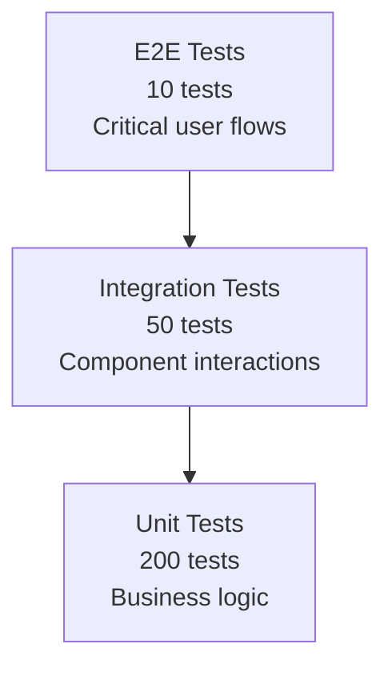

# Genesis Section 08: Testing Strategy

**Purpose:** Guide for documenting comprehensive testing approach across all layers.

---

## Section Overview

The Testing Strategy section defines how quality is ensured through automated testing, coverage targets, and quality gates.

### Key Components

1. **Testing Pyramid**: Unit, integration, E2E tests with coverage targets
2. **Test Automation**: CI/CD integration, test frameworks, performance testing
3. **Quality Gates**: Metrics, code quality, review requirements

---

## 8.1 Testing Pyramid

### Overview



### Unit Tests (Base of Pyramid)

**Coverage Target:** 80%+ for business logic

**What to Test:**
- Pure functions
- Business logic
- Utility functions
- Data transformations
- Validation logic

**Example:**
```typescript
// Test: Video duration calculation
describe('calculateVideoDuration', () => {
  it('should calculate total duration from timeline elements', () => {
    const elements = [
      { startTime: 0, duration: 10 },
      { startTime: 5, duration: 8 },
      { startTime: 15, duration: 5 },
    ];
    
    expect(calculateVideoDuration(elements)).toBe(20); // max(10, 13, 20)
  });
  
  it('should return 0 for empty timeline', () => {
    expect(calculateVideoDuration([])).toBe(0);
  });
  
  it('should handle overlapping elements', () => {
    const elements = [
      { startTime: 0, duration: 10 },
      { startTime: 5, duration: 10 },
    ];
    
    expect(calculateVideoDuration(elements)).toBe(15);
  });
});

// Test: Validation logic
describe('validateProject', () => {
  it('should accept valid project', () => {
    const project = createValidProject();
    expect(() => validateProject(project)).not.toThrow();
  });
  
  it('should reject project with invalid name', () => {
    const project = createValidProject({ name: '' });
    expect(() => validateProject(project)).toThrow('Project name cannot be empty');
  });
  
  it('should reject project with negative duration', () => {
    const project = createValidProject({ timeline: { duration: -5 } });
    expect(() => validateProject(project)).toThrow('duration must be non-negative');
  });
});
```

### Integration Tests (Middle of Pyramid)

**Coverage Target:** 60%+ for component interactions

**What to Test:**
- Component integration
- API endpoints
- Database operations
- External service mocks
- State management flows

**Example:**
```typescript
// Test: API endpoint
describe('POST /api/projects', () => {
  let testUser: User;
  let authToken: string;
  
  beforeEach(async () => {
    testUser = await createTestUser();
    authToken = await getAuthToken(testUser);
  });
  
  afterEach(async () => {
    await cleanupTestUser(testUser);
  });
  
  it('should create project for authenticated user', async () => {
    const response = await fetch('http://localhost:3000/api/projects', {
      method: 'POST',
      headers: {
        'Authorization': `Bearer ${authToken}`,
        'Content-Type': 'application/json',
      },
      body: JSON.stringify({
        name: 'Test Project',
        metadata: {
          resolution: { width: 1920, height: 1080 },
          frameRate: 30,
        },
      }),
    });
    
    expect(response.status).toBe(201);
    const project = await response.json();
    expect(project.name).toBe('Test Project');
    expect(project.userId).toBe(testUser.id);
  });
  
  it('should return 401 for unauthenticated request', async () => {
    const response = await fetch('http://localhost:3000/api/projects', {
      method: 'POST',
      headers: { 'Content-Type': 'application/json' },
      body: JSON.stringify({ name: 'Test' }),
    });
    
    expect(response.status).toBe(401);
  });
});

// Test: Zustand store integration
describe('Editor Store', () => {
  it('should add element to timeline', () => {
    const store = createEditorStore();
    const element = createTestElement();
    
    store.addElement('track-1', element);
    
    const track = store.tracks.find(t => t.id === 'track-1');
    expect(track?.elements).toContainEqual(element);
  });
  
  it('should persist changes to IndexedDB', async () => {
    const store = createEditorStore();
    const element = createTestElement();
    
    await store.addElement('track-1', element);
    
    // Wait for debounced save
    await new Promise(resolve => setTimeout(resolve, 600));
    
    const savedProject = await db.projects.get(store.projectId);
    expect(savedProject.timeline.tracks[0].elements).toContainEqual(element);
  });
});
```

### E2E Tests (Top of Pyramid)

**Coverage Target:** Critical user flows only

**What to Test:**
- Complete user journeys
- Authentication flows
- Core features end-to-end
- Cross-browser compatibility
- Mobile responsiveness

**Example (Playwright):**
```typescript
// Test: Video upload and editing flow
test('user can upload video and add to timeline', async ({ page }) => {
  // Login
  await page.goto('http://localhost:3000/login');
  await page.fill('input[name="email"]', 'test@example.com');
  await page.fill('input[name="password"]', 'password123');
  await page.click('button[type="submit"]');
  
  // Wait for dashboard
  await page.waitForURL('**/dashboard');
  
  // Create new project
  await page.click('text=New Project');
  await page.fill('input[placeholder="Project name"]', 'E2E Test Project');
  await page.click('button:has-text("Create")');
  
  // Wait for editor
  await page.waitForURL('**/editor/*');
  
  // Upload video
  const fileInput = await page.locator('input[type="file"]');
  await fileInput.setInputFiles('./tests/fixtures/test-video.mp4');
  
  // Wait for upload to complete
  await page.waitForSelector('text=Upload complete', { timeout: 30000 });
  
  // Add video to timeline
  await page.click('[data-testid="media-item-1"]');
  await page.click('button:has-text("Add to Timeline")');
  
  // Verify video appears on timeline
  const timelineElement = await page.locator('[data-testid^="timeline-element-"]').first();
  await expect(timelineElement).toBeVisible();
  
  // Verify preview updates
  const preview = await page.locator('[data-testid="video-preview"]');
  await expect(preview).toHaveAttribute('src', /blob:/);
});

// Test: AI chat interaction
test('user can chat with AI assistant', async ({ page }) => {
  await loginAs(page, 'test@example.com');
  await page.goto('http://localhost:3000/editor/test-project-id');
  
  // Open AI chat
  await page.click('button[aria-label="AI Assistant"]');
  
  // Send message
  await page.fill('textarea[placeholder="Ask AI assistant..."]', 'Add a fade transition');
  await page.press('textarea', 'Enter');
  
  // Wait for AI response
  await page.waitForSelector('.ai-message', { timeout: 10000 });
  
  // Verify response
  const response = await page.textContent('.ai-message:last-child');
  expect(response).toContain('fade');
});
```

---

## 8.2 Test Automation

### CI/CD Integration

```yaml
# .circleci/config.yml
version: 2.1

jobs:
  test:
    docker:
      - image: cimg/node:18.17
      - image: cimg/postgres:15.3
      - image: cimg/redis:7.0
    
    steps:
      - checkout
      
      - restore_cache:
          keys:
            - v1-deps-{{ checksum "package-lock.json" }}
      
      - run:
          name: Install Dependencies
          command: npm ci
      
      - save_cache:
          paths:
            - node_modules
          key: v1-deps-{{ checksum "package-lock.json" }}
      
      - run:
          name: Lint
          command: npm run lint
      
      - run:
          name: Type Check
          command: npm run type-check
      
      - run:
          name: Unit Tests
          command: npm run test:unit -- --coverage
      
      - run:
          name: Integration Tests
          command: npm run test:integration
      
      - run:
          name: Upload Coverage
          command: npx codecov
      
      - store_test_results:
          path: test-results
      
      - store_artifacts:
          path: coverage

  e2e:
    docker:
      - image: mcr.microsoft.com/playwright:v1.40.0
    
    steps:
      - checkout
      - run: npm ci
      - run: npx playwright install
      - run:
          name: E2E Tests
          command: npm run test:e2e
      
      - store_test_results:
          path: playwright-report
      
      - store_artifacts:
          path: playwright-report

workflows:
  test:
    jobs:
      - test
      - e2e:
          requires:
            - test
```

### Test Frameworks

**Unit & Integration Tests:**
- **Framework:** Vitest (faster than Jest, Vite-powered)
- **Assertions:** Vitest built-in (Jest-compatible API)
- **Mocking:** Vitest mocks + MSW for API mocking
- **Coverage:** c8 (built into Vitest)

**E2E Tests:**
- **Framework:** Playwright (cross-browser, reliable)
- **Browsers:** Chromium, Firefox, WebKit
- **Parallelization:** 4 workers
- **Retries:** 2 retries for flaky tests

**Configuration:**
```typescript
// vitest.config.ts
import { defineConfig } from 'vitest/config';

export default defineConfig({
  test: {
    globals: true,
    environment: 'jsdom',
    setupFiles: ['./tests/setup.ts'],
    coverage: {
      provider: 'c8',
      reporter: ['text', 'json', 'html'],
      exclude: [
        'node_modules/',
        'tests/',
        '**/*.config.*',
        '**/*.d.ts',
      ],
      lines: 80,
      functions: 80,
      branches: 75,
      statements: 80,
    },
  },
});

// playwright.config.ts
import { defineConfig, devices } from '@playwright/test';

export default defineConfig({
  testDir: './tests/e2e',
  fullyParallel: true,
  forbidOnly: \!\!process.env.CI,
  retries: process.env.CI ? 2 : 0,
  workers: process.env.CI ? 4 : undefined,
  reporter: 'html',
  use: {
    baseURL: 'http://localhost:3000',
    trace: 'on-first-retry',
    screenshot: 'only-on-failure',
  },
  projects: [
    { name: 'chromium', use: { ...devices['Desktop Chrome'] } },
    { name: 'firefox', use: { ...devices['Desktop Firefox'] } },
    { name: 'webkit', use: { ...devices['Desktop Safari'] } },
    { name: 'mobile-chrome', use: { ...devices['Pixel 5'] } },
  ],
  webServer: {
    command: 'npm run dev',
    url: 'http://localhost:3000',
    reuseExistingServer: \!process.env.CI,
  },
});
```

### Performance Testing

**Load Testing:**
```typescript
// k6 load test script
import http from 'k6/http';
import { check, sleep } from 'k6';

export const options = {
  stages: [
    { duration: '30s', target: 20 },  // Ramp up to 20 users
    { duration: '1m', target: 20 },   // Stay at 20 users
    { duration: '30s', target: 0 },   // Ramp down
  ],
  thresholds: {
    http_req_duration: ['p(95)<500'], // 95% of requests < 500ms
    http_req_failed: ['rate<0.01'],   // Error rate < 1%
  },
};

export default function () {
  const res = http.get('https://api.example.com/api/projects', {
    headers: { 'Authorization': `Bearer ${__ENV.AUTH_TOKEN}` },
  });
  
  check(res, {
    'status is 200': (r) => r.status === 200,
    'response time < 500ms': (r) => r.timings.duration < 500,
  });
  
  sleep(1);
}
```

**Browser Performance Testing:**
```typescript
// Lighthouse CI config
module.exports = {
  ci: {
    collect: {
      url: ['http://localhost:3000/', 'http://localhost:3000/editor'],
      numberOfRuns: 3,
    },
    assert: {
      preset: 'lighthouse:recommended',
      assertions: {
        'categories:performance': ['error', { minScore: 0.9 }],
        'categories:accessibility': ['error', { minScore: 0.9 }],
        'categories:best-practices': ['error', { minScore: 0.9 }],
        'categories:seo': ['error', { minScore: 0.9 }],
        'first-contentful-paint': ['error', { maxNumericValue: 2000 }],
        'largest-contentful-paint': ['error', { maxNumericValue: 2500 }],
        'cumulative-layout-shift': ['error', { maxNumericValue: 0.1 }],
      },
    },
    upload: {
      target: 'temporary-public-storage',
    },
  },
};
```

---

## 8.3 Quality Gates

### Code Coverage Requirements

**Coverage Targets:**
- Unit Tests: 80% lines, 80% functions, 75% branches
- Integration Tests: 60% of integration points
- E2E Tests: 100% of critical user flows

**Enforcement:**
```json
// package.json
{
  "scripts": {
    "test:coverage": "vitest run --coverage",
    "test:coverage:check": "vitest run --coverage && node scripts/check-coverage.js"
  }
}
```

```javascript
// scripts/check-coverage.js
const coverage = require('../coverage/coverage-summary.json');

const thresholds = {
  lines: 80,
  functions: 80,
  branches: 75,
  statements: 80,
};

let failed = false;

Object.entries(coverage.total).forEach(([metric, data]) => {
  if (thresholds[metric] && data.pct < thresholds[metric]) {
    console.error(`❌ ${metric} coverage ${data.pct}% < ${thresholds[metric]}%`);
    failed = true;
  } else {
    console.log(`✅ ${metric} coverage ${data.pct}%`);
  }
});

process.exit(failed ? 1 : 0);
```

### Code Quality Metrics

**Linting:**
- ESLint with strict rules
- Prettier for formatting
- No warnings allowed in CI

**Type Safety:**
- TypeScript strict mode
- No `any` types (except specific exceptions)
- 100% type coverage

**Code Complexity:**
- Cyclomatic complexity < 10 per function
- Max file length: 300 lines
- Max function length: 50 lines

**Configuration:**
```json
// .eslintrc.json
{
  "extends": [
    "next/core-web-vitals",
    "plugin:@typescript-eslint/recommended",
    "prettier"
  ],
  "rules": {
    "@typescript-eslint/no-explicit-any": "error",
    "@typescript-eslint/no-unused-vars": "error",
    "complexity": ["error", 10],
    "max-lines": ["error", 300],
    "max-lines-per-function": ["error", 50]
  }
}

// tsconfig.json
{
  "compilerOptions": {
    "strict": true,
    "noUncheckedIndexedAccess": true,
    "noImplicitReturns": true,
    "noFallthroughCasesInSwitch": true,
    "noUnusedLocals": true,
    "noUnusedParameters": true
  }
}
```

### Pull Request Requirements

**Before Merge:**
- [ ] All tests pass (unit, integration, E2E)
- [ ] Code coverage meets thresholds
- [ ] Linting passes with no warnings
- [ ] Type checking passes
- [ ] Performance benchmarks pass
- [ ] Code review approved by 1+ reviewers
- [ ] No merge conflicts
- [ ] Branch is up-to-date with main

**GitHub Actions Workflow:**
```yaml
name: PR Checks

on:
  pull_request:
    branches: [main, develop]

jobs:
  checks:
    runs-on: ubuntu-latest
    steps:
      - uses: actions/checkout@v3
      - uses: actions/setup-node@v3
        with:
          node-version: '18'
          cache: 'npm'
      
      - run: npm ci
      - run: npm run lint
      - run: npm run type-check
      - run: npm run test:coverage
      - run: npm run test:e2e
      
      - name: Comment Coverage
        uses: codecov/codecov-action@v3
        with:
          token: ${{ secrets.CODECOV_TOKEN }}
      
      - name: Check Coverage Thresholds
        run: npm run test:coverage:check
```

---

## Best Practices

1. **Write tests first** (TDD for complex logic)
2. **Test behavior, not implementation**
3. **Keep tests isolated** (no shared state)
4. **Use descriptive test names**
5. **Mock external dependencies**
6. **Test edge cases**
7. **Keep tests fast** (unit tests < 1s each)
8. **Run tests in CI/CD**
9. **Monitor flaky tests** (fix or remove)
10. **Update tests with code changes**

---

## Perplexity Research Queries

- "Testing pyramid best practices 2025"
- "Vitest vs Jest performance comparison"
- "Playwright E2E testing patterns"
- "API load testing with k6"
- "Code coverage thresholds for production apps"
- "Flaky test prevention strategies"

---

## Quality Checklist

- [ ] Testing pyramid documented (unit, integration, E2E)
- [ ] Coverage targets specified
- [ ] Test frameworks chosen and configured
- [ ] CI/CD integration configured
- [ ] Performance testing approach defined
- [ ] Code quality metrics established
- [ ] Quality gates enforced
- [ ] PR requirements documented
- [ ] Test examples provided
- [ ] Flaky test handling strategy defined

---

## Version History

**v1.0** (2025-11-09): Initial section guide

