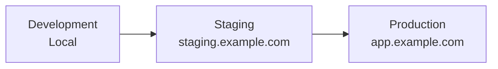
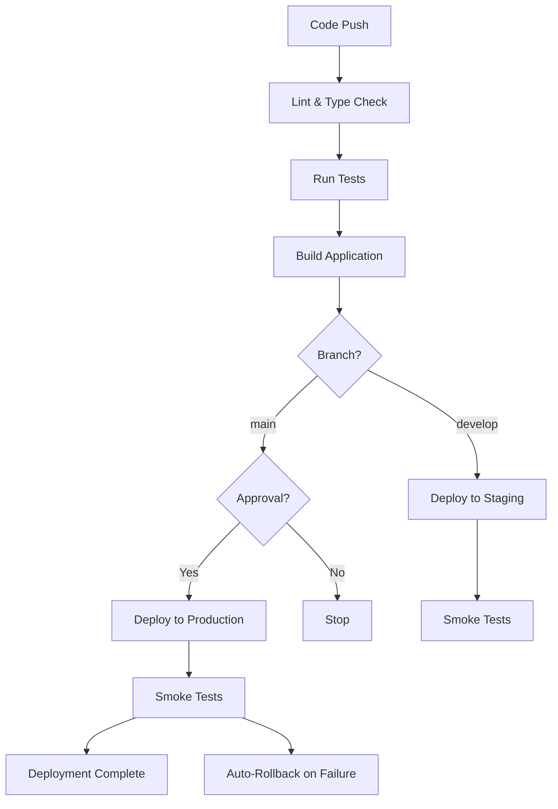

# Genesis Section 10: Deployment & Operations

**Purpose:** Guide for documenting deployment strategies, infrastructure setup, and operational runbooks.

---

## Section Overview

The Deployment & Operations section defines how code gets to production and how the system runs reliably.

### Key Components

1. **Deployment Strategy**: Environments, deployment process, release strategy
2. **Infrastructure**: IaC, scaling strategies, disaster recovery
3. **Operational Runbooks**: Common procedures, troubleshooting guides

---

## 10.1 Deployment Strategy

### Environments

**Environment Hierarchy:**


**Environment Configuration:**

| Environment | Purpose | Data | Deployment | Access |
|-------------|---------|------|------------|--------|
| **Development** | Local development | Mocked/seeded | Manual (npm run dev) | All engineers |
| **Staging** | Pre-production testing | Anonymized production copy | Auto on merge to develop | QA, engineers |
| **Production** | Live system | Real user data | Auto on merge to main (after approval) | Ops team, limited engineers |

**Environment Variables:**
```bash
# .env.development
NODE_ENV=development
DATABASE_URL=postgresql://localhost:5432/app_dev
REDIS_URL=redis://localhost:6379
NEXT_PUBLIC_API_URL=http://localhost:3000/api
GEMINI_API_KEY=test_key

# .env.staging
NODE_ENV=staging
DATABASE_URL=postgresql://staging-db.railway.app:5432/app_staging
REDIS_URL=redis://staging-redis.railway.app:6379
NEXT_PUBLIC_API_URL=https://staging-api.example.com/api
GEMINI_API_KEY=${STAGING_GEMINI_KEY}

# .env.production
NODE_ENV=production
DATABASE_URL=postgresql://prod-db.railway.app:5432/app_prod
REDIS_URL=redis://prod-redis.railway.app:6379
NEXT_PUBLIC_API_URL=https://api.example.com/api
GEMINI_API_KEY=${PROD_GEMINI_KEY}
```

### Deployment Process

**CI/CD Pipeline:**


**Deployment Configuration:**
```yaml
# .github/workflows/deploy.yml
name: Deploy

on:
  push:
    branches: [main, develop]

jobs:
  deploy:
    runs-on: ubuntu-latest
    steps:
      - uses: actions/checkout@v3
      
      - name: Setup Node
        uses: actions/setup-node@v3
        with:
          node-version: '18'
          cache: 'npm'
      
      - name: Install Dependencies
        run: npm ci
      
      - name: Lint
        run: npm run lint
      
      - name: Type Check
        run: npm run type-check
      
      - name: Run Tests
        run: npm run test:ci
      
      - name: Build
        run: npm run build
        env:
          NODE_ENV: ${{ github.ref == 'refs/heads/main' && 'production' || 'staging' }}
      
      - name: Deploy to Vercel (Staging)
        if: github.ref == 'refs/heads/develop'
        run: vercel deploy --prebuilt
        env:
          VERCEL_ORG_ID: ${{ secrets.VERCEL_ORG_ID }}
          VERCEL_PROJECT_ID: ${{ secrets.VERCEL_PROJECT_ID }}
          VERCEL_TOKEN: ${{ secrets.VERCEL_TOKEN }}
      
      - name: Deploy to Vercel (Production)
        if: github.ref == 'refs/heads/main'
        run: vercel deploy --prebuilt --prod
        env:
          VERCEL_ORG_ID: ${{ secrets.VERCEL_ORG_ID }}
          VERCEL_PROJECT_ID: ${{ secrets.VERCEL_PROJECT_ID }}
          VERCEL_TOKEN: ${{ secrets.VERCEL_TOKEN }}
      
      - name: Smoke Tests
        run: npm run test:smoke
        env:
          BASE_URL: ${{ github.ref == 'refs/heads/main' && 'https://app.example.com' || 'https://staging.example.com' }}
      
      - name: Notify Slack
        if: always()
        uses: slackapi/slack-github-action@v1
        with:
          payload: |
            {
              "status": "${{ job.status }}",
              "environment": "${{ github.ref == 'refs/heads/main' && 'Production' || 'Staging' }}",
              "commit": "${{ github.sha }}",
              "author": "${{ github.actor }}"
            }
```

### Release Strategy

**Release Types:**

**1. Hotfix (Emergency)**
- **Trigger:** Critical bug in production
- **Process:** Branch from main → Fix → Deploy immediately
- **Approval:** 1 senior engineer review
- **Rollback:** Automatic if smoke tests fail

**2. Regular Release (Weekly)**
- **Trigger:** Merge develop → main
- **Process:** QA in staging → Approval → Deploy
- **Approval:** Product manager + 2 engineer reviews
- **Rollback:** Manual within 1 hour window

**3. Feature Flag Release (Gradual)**
- **Trigger:** New experimental feature
- **Process:** Deploy with flag disabled → Enable for 1% → 10% → 50% → 100%
- **Approval:** Product manager
- **Rollback:** Disable flag (no redeployment needed)

**Feature Flags:**
```typescript
// feature-flags.ts
export const featureFlags = {
  'new-timeline-ui': {
    enabled: process.env.ENABLE_NEW_TIMELINE === 'true',
    rollout: 0.1, // 10% of users
  },
  'ai-video-generation': {
    enabled: process.env.ENABLE_AI_VIDEO === 'true',
    rollout: 1.0, // 100% of users
  },
};

export function isFeatureEnabled(flagName: string, userId: string): boolean {
  const flag = featureFlags[flagName];
  if (\!flag || \!flag.enabled) return false;
  
  // Consistent hashing for gradual rollout
  const hash = hashUserId(userId);
  return (hash % 100) / 100 < flag.rollout;
}

// Usage
if (isFeatureEnabled('new-timeline-ui', user.id)) {
  return <NewTimelineUI />;
} else {
  return <OldTimelineUI />;
}
```

**Deployment Checklist:**
- [ ] All tests pass (unit, integration, E2E)
- [ ] Code reviewed and approved
- [ ] Database migrations tested (if applicable)
- [ ] Environment variables updated (if needed)
- [ ] Feature flags configured
- [ ] Monitoring alerts configured
- [ ] Rollback plan documented
- [ ] Stakeholders notified
- [ ] Deployed to staging first
- [ ] Smoke tests pass on staging
- [ ] Production deployment approved
- [ ] Smoke tests pass on production
- [ ] Post-deployment monitoring (30 minutes)

---

## 10.2 Infrastructure

### Infrastructure as Code (IaC)

**Frontend (Vercel):**
```json
// vercel.json
{
  "version": 2,
  "builds": [
    {
      "src": "package.json",
      "use": "@vercel/next"
    }
  ],
  "env": {
    "NEXT_PUBLIC_API_URL": "@api-url",
    "SENTRY_DSN": "@sentry-dsn"
  },
  "regions": ["iad1", "sfo1"],
  "functions": {
    "api/**/*.ts": {
      "maxDuration": 30,
      "memory": 1024
    }
  },
  "headers": [
    {
      "source": "/(.*)",
      "headers": [
        {
          "key": "X-Frame-Options",
          "value": "SAMEORIGIN"
        },
        {
          "key": "X-Content-Type-Options",
          "value": "nosniff"
        }
      ]
    }
  ],
  "rewrites": [
    {
      "source": "/api/:path*",
      "destination": "https://api.example.com/api/:path*"
    }
  ]
}
```

**Backend (Railway):**
```dockerfile
# Dockerfile for ComfyUI gateway
FROM python:3.13-slim

WORKDIR /app

# Install system dependencies
RUN apt-get update && apt-get install -y \
    git \
    ffmpeg \
    && rm -rf /var/lib/apt/lists/*

# Install Python dependencies
COPY requirements.txt .
RUN pip install --no-cache-dir -r requirements.txt

# Copy application
COPY . .

# Expose port
EXPOSE 8000

# Health check
HEALTHCHECK --interval=30s --timeout=3s --start-period=5s --retries=3 \
  CMD python -c "import requests; requests.get('http://localhost:8000/health')"

# Start application
CMD ["uvicorn", "main:app", "--host", "0.0.0.0", "--port", "8000"]
```

```yaml
# railway.yml
services:
  - name: comfyui-gateway
    type: web
    runtime: docker
    dockerfile: Dockerfile
    env:
      - PORT=8000
      - DATABASE_URL=${{Postgres.DATABASE_URL}}
      - REDIS_URL=${{Redis.REDIS_URL}}
    resources:
      memory: 2Gi
      cpu: 2
      gpu: nvidia-t4
    healthcheck:
      path: /health
      interval: 30s
      timeout: 3s
    
  - name: postgres
    type: database
    plan: postgres
    version: 15
    resources:
      memory: 4Gi
    
  - name: redis
    type: database
    plan: redis
    version: 7
    resources:
      memory: 1Gi
```

### Scaling Strategy

**Horizontal Scaling:**

**Frontend (Vercel):**
- Auto-scales based on traffic
- Edge functions deployed globally
- No configuration needed (managed by Vercel)

**Backend (Railway):**
```yaml
# Auto-scaling config
scaling:
  min_instances: 1
  max_instances: 10
  target_cpu_utilization: 70
  target_memory_utilization: 80
  scale_up_cooldown: 60s
  scale_down_cooldown: 300s
```

**Database (PostgreSQL):**
- Primary database: Railway managed (auto-scaling storage)
- Read replicas: 2 replicas for read-heavy queries
- Connection pooling: PgBouncer (max 100 connections)

**Caching (Redis):**
- Single instance for MVP
- Cluster mode for production (3 nodes)
- Eviction policy: LRU for cache, no eviction for queues

**Vertical Scaling:**
| Service | Initial | Scale Up Trigger | Scale Up To |
|---------|---------|------------------|-------------|
| ComfyUI Gateway | 2 CPU, 2GB RAM, T4 GPU | CPU > 70% for 5 min | 4 CPU, 4GB RAM, A10 GPU |
| PostgreSQL | 2 CPU, 4GB RAM | Connections > 80 | 4 CPU, 8GB RAM |
| Redis | 1 CPU, 1GB RAM | Memory > 75% | 2 CPU, 2GB RAM |

### Disaster Recovery

**Backup Strategy:**

**Database Backups:**
- **Frequency:** Daily automated backups (Railway managed)
- **Retention:** 30 days
- **Storage:** S3 (encrypted at rest)
- **Testing:** Monthly restore test to staging

**File Backups:**
- **User Files:** Stored in OPFS (client-side, no backup needed)
- **Generated Videos:** Object storage with lifecycle policy (7-day retention)
- **Project Metadata:** Backed up with database

**Recovery Time Objectives:**
| Data Type | RTO (Recovery Time) | RPO (Recovery Point) |
|-----------|---------------------|----------------------|
| Database | 1 hour | 24 hours (daily backup) |
| Application | 15 minutes | 0 (stateless, redeploy) |
| Generated Videos | 4 hours | 24 hours |
| User Files (OPFS) | N/A | N/A (client-side only) |

**Disaster Recovery Plan:**

1. **Database Failure:**
   - Detect via health check (30s interval)
   - Automatic failover to read replica (promoted to primary)
   - Restore from latest backup if failover fails
   - ETA: 1 hour

2. **Application Failure:**
   - Auto-restart (Railway manages)
   - If restart fails, rollback to previous deployment
   - ETA: 15 minutes

3. **Region Outage:**
   - Vercel automatically routes to other regions (global CDN)
   - Backend: Manual failover to backup region
   - ETA: 4 hours

4. **Data Corruption:**
   - Identify corruption via integrity checks
   - Restore from latest clean backup
   - Replay transaction logs if available
   - ETA: 2-4 hours

---

## 10.3 Operational Runbooks

### Common Procedures

#### Deploy New Release

**Pre-Deployment:**
1. Verify all tests pass in CI
2. Review code changes
3. Check for breaking changes
4. Update changelog
5. Notify team in Slack

**Deployment:**
1. Merge PR to main branch
2. Automated deployment starts
3. Monitor deployment progress
4. Wait for smoke tests to pass

**Post-Deployment:**
1. Monitor error rates for 30 minutes
2. Check performance metrics
3. Verify key features work
4. Notify team of completion

**Rollback (if needed):**
1. Identify issue within 1-hour window
2. Click "Revert to Previous" in Vercel dashboard
3. Verify rollback successful
4. Investigate root cause
5. Create hotfix branch

#### Scale Services

**When to Scale:**
- CPU usage > 70% for 10 minutes
- Memory usage > 80% for 5 minutes
- Response time > 1s at p95 for 10 minutes
- Queue depth > 100 jobs for 5 minutes

**How to Scale:**

**Frontend:** Auto-scales (Vercel managed)

**Backend:**
```bash
# Railway CLI
railway up --replicas 5

# Or via Railway dashboard
# Services → comfyui-gateway → Settings → Replicas → 5
```

**Database:**
```bash
# Upgrade plan via Railway dashboard
# Resources → Postgres → Upgrade Plan → Pro (4 CPU, 8GB RAM)
```

#### Database Maintenance

**Weekly Tasks:**
```sql
-- Analyze tables for query optimizer
ANALYZE;

-- Vacuum to reclaim space
VACUUM (ANALYZE);

-- Check for bloated indexes
SELECT schemaname, tablename, pg_size_pretty(pg_total_relation_size(schemaname||'.'||tablename)) AS size
FROM pg_tables
ORDER BY pg_total_relation_size(schemaname||'.'||tablename) DESC
LIMIT 10;

-- Reindex if needed
REINDEX INDEX CONCURRENTLY idx_name;
```

**Monthly Tasks:**
- Review slow queries (> 1s)
- Optimize inefficient queries
- Archive old data (> 1 year)
- Test backup restore to staging

### Troubleshooting Guide

#### High Error Rate

**Symptoms:**
- Sentry error rate > 5%
- User complaints
- 5xx status codes in logs

**Diagnosis:**
```bash
# Check error logs
railway logs --service comfyui-gateway --tail 100 --level error

# Check Sentry for common errors
# Group by error type, sort by frequency

# Check infrastructure metrics
railway metrics --service comfyui-gateway
```

**Resolution:**
1. Identify root cause (code bug, infrastructure, external service)
2. If code bug: Deploy hotfix
3. If infrastructure: Scale up resources
4. If external service: Enable fallback or queue requests

#### Slow API Response

**Symptoms:**
- Response time > 1s at p95
- User complaints about sluggishness
- Timeout errors

**Diagnosis:**
```bash
# Check API performance in Sentry
# Performance → Transactions → Sort by p95

# Check database query performance
SELECT query, mean_exec_time, calls
FROM pg_stat_statements
ORDER BY mean_exec_time DESC
LIMIT 10;

# Check Redis latency
redis-cli --latency
```

**Resolution:**
1. If slow queries: Add indexes, optimize queries
2. If high load: Scale up infrastructure
3. If external API: Cache responses, use faster endpoint
4. If network: Check CDN, enable compression

#### Database Connection Pool Exhausted

**Symptoms:**
- "Too many connections" errors
- API requests timing out
- Connection errors in logs

**Diagnosis:**
```sql
-- Check current connections
SELECT count(*) FROM pg_stat_activity;

-- Check connection sources
SELECT application_name, count(*)
FROM pg_stat_activity
GROUP BY application_name;

-- Check idle connections
SELECT count(*) FROM pg_stat_activity WHERE state = 'idle';
```

**Resolution:**
1. Increase max connections in PostgreSQL config
2. Add/configure connection pooling (PgBouncer)
3. Fix connection leaks in application code
4. Kill idle connections: `SELECT pg_terminate_backend(pid) FROM pg_stat_activity WHERE state = 'idle';`

#### Out of Memory

**Symptoms:**
- 502/503 errors
- Service crashes
- "Out of memory" in logs

**Diagnosis:**
```bash
# Check memory usage
railway metrics --service comfyui-gateway --metric memory

# Check memory-intensive processes
ps aux --sort=-%mem | head -n 10

# Check for memory leaks
# Review heap snapshots in profiling tools
```

**Resolution:**
1. Scale up memory resources
2. Identify memory leaks (use profiler)
3. Optimize memory-intensive operations
4. Add memory limits to prevent OOM

---

## Best Practices

1. **Automate everything:** Reduce human error
2. **Immutable infrastructure:** Replace, don't modify
3. **Zero-downtime deploys:** Rolling updates, blue-green
4. **Monitor deployments:** Watch metrics during rollout
5. **Fast rollback:** One-click revert to previous version
6. **Document procedures:** Runbooks for common tasks
7. **Test disaster recovery:** Practice restores
8. **Version everything:** IaC, configs, secrets
9. **Least privilege access:** Minimum necessary permissions
10. **Audit logs:** Track all infrastructure changes

---

## Perplexity Research Queries

- "Zero-downtime deployment strategies for [platform]"
- "Infrastructure as Code best practices with [tool]"
- "Database backup and recovery strategies"
- "Auto-scaling strategies for [service type]"
- "Feature flag implementation patterns"
- "Disaster recovery planning for cloud applications"

---

## Quality Checklist

- [ ] Environments clearly defined (dev, staging, prod)
- [ ] CI/CD pipeline configured and tested
- [ ] Deployment process documented
- [ ] Release strategy defined
- [ ] Infrastructure as Code implemented
- [ ] Scaling strategy documented
- [ ] Backup strategy configured
- [ ] Disaster recovery plan documented
- [ ] RTO/RPO defined for all data types
- [ ] Runbooks created for common procedures
- [ ] Troubleshooting guides provided
- [ ] Rollback procedures tested
- [ ] Monitoring during deployments configured

---

## Version History

**v1.0** (2025-11-09): Initial section guide

